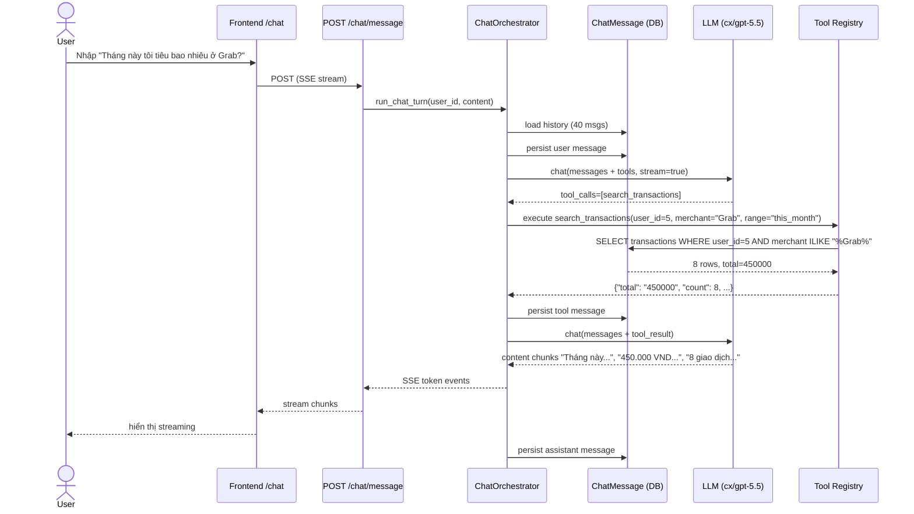
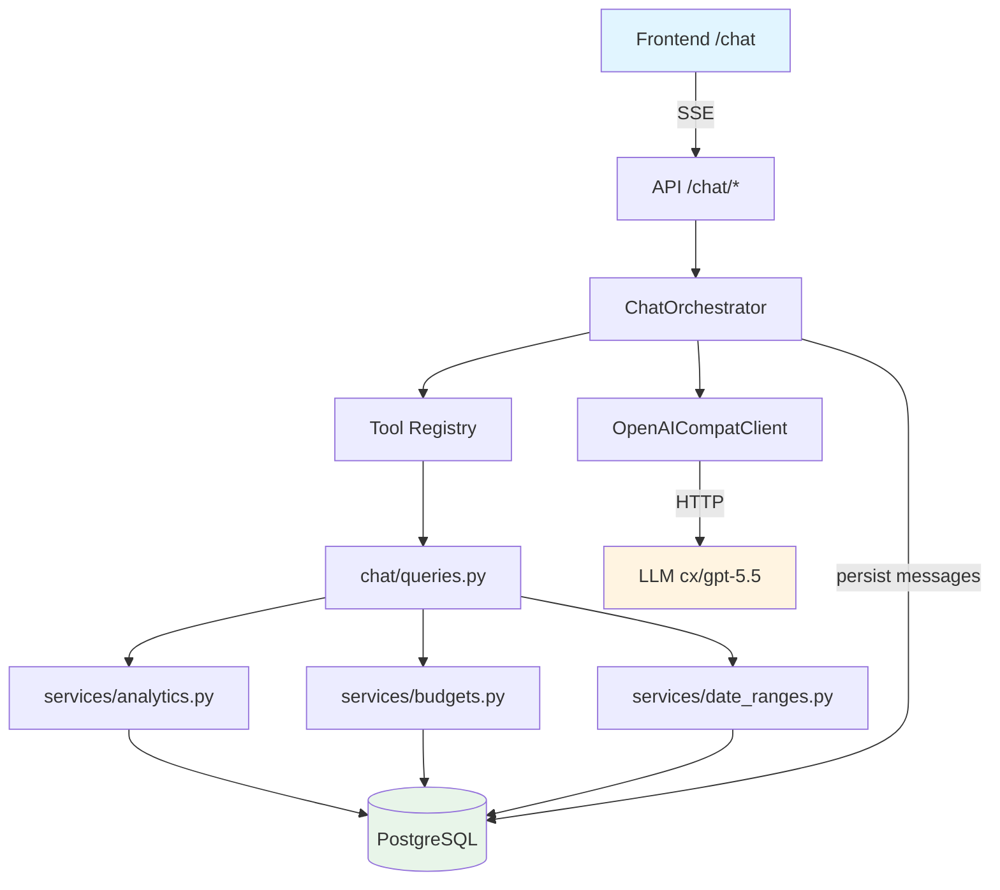

# Design Document — AI Chatbot

## Overview

Chatbot conversational thay thế module AI Insights cũ. Dùng LLM OpenAI-compatible với
function calling để trả lời câu hỏi chi tiêu cá nhân. Mọi số liệu đến từ DB thực qua tool
layer; LLM không bao giờ truy cập DB trực tiếp.

### Design Goals
1. **Không hallucinate**: mọi số tiền, ngày, category name phải từ tool result.
2. **Tái sử dụng services**: bọc `analytics`, `budgets`, `date_ranges` thành tools thay
   vì viết lại logic.
3. **User isolation enforced server-side**: tool luôn filter `user_id` của session hiện
   tại, bất kể LLM truyền gì trong args.
4. **Streaming mượt**: SSE để user thấy response thời gian thực.
5. **Unlimited history**: persist tất cả messages, không auto-expire.

### Key Decisions

**Decision 1: Function Calling thay vì RAG hay Text-to-SQL**
- Rationale: data đã structured trong PostgreSQL; function calling chính xác nhất.
- Tradeoff: cần viết thêm query functions, nhưng tái sử dụng được services đã có.

**Decision 2: OpenAI-compatible client thay vì SDK riêng**
- Rationale: endpoint `cx/gpt-5.5` đã theo spec OpenAI; client HTTP thuần dễ test + swap provider.
- Tradeoff: không có built-in retry/rate-limit, phải tự implement.

**Decision 3: SSE thay vì WebSocket**
- Rationale: streaming 1 chiều đủ cho chatbot; SSE đơn giản hơn, dùng cookie auth được.
- Tradeoff: không full-duplex; không vấn đề vì user gửi HTTP POST riêng.

**Decision 4: In-memory rate limit (không dùng Redis cho MVP)**
- Rationale: giảm complexity; production có thể swap sang Redis counter.
- Tradeoff: rate limit không share giữa API replicas; chấp nhận cho MVP single-instance.

**Decision 5: Enforce user_id server-side (defense in depth)**
- Rationale: LLM có thể bị prompt-inject để truyền user_id khác; luôn override.
- Tradeoff: tool signature phải accept user_id riêng khỏi args.

## Architecture

### High-Level Flow



### Component Diagram



### Module Layout

```
backend/api/app/services/chat/
├── __init__.py
├── queries.py          # 7 query functions (Requirement 2)
├── llm_client.py       # OpenAICompatClient (Requirement 3)
├── orchestrator.py     # ChatOrchestrator (Requirement 4)
├── tools.py            # Tool Registry + schema definitions
├── safety.py           # Banned phrases filter, rate limit
└── system_prompt.py    # Vietnamese system prompt

backend/api/app/api/v1/chat.py    # SSE endpoints (Requirement 5)
backend/api/app/schemas/chat.py   # Request/Response schemas

backend/shared/pfa_shared/entities.py   # + ChatMessage entity

frontend/web/app/chat/
├── page.tsx
├── chat-client.tsx
├── message-bubble.tsx
├── suggested-questions.tsx
└── input-bar.tsx

frontend/web/lib/chat-api.ts      # Frontend client (SSE + history)
```

## Components and Interfaces

### 1. Tool Registry (`services/chat/tools.py`)

```python
@dataclass(frozen=True)
class ToolDefinition:
    name: str
    description: str
    parameters_schema: dict  # JSON Schema for LLM
    handler: Callable  # Backend function

TOOL_REGISTRY: dict[str, ToolDefinition] = {
    "query_spending_summary": ToolDefinition(
        name="query_spending_summary",
        description="Lấy tổng chi tiêu của user trong khoảng thời gian, kèm top categories",
        parameters_schema={
            "type": "object",
            "properties": {
                "date_range": {
                    "type": "string",
                    "enum": ["7d", "30d", "this_month", "last_month"],
                    "description": "Khoảng thời gian preset"
                },
                "category_name": {
                    "type": "string",
                    "description": "Tên category lọc theo (optional)"
                }
            },
            "required": ["date_range"]
        },
        handler=query_spending_summary,
    ),
    # ... 6 tools khác
}

def get_openai_tools() -> list[dict]:
    """Chuyển TOOL_REGISTRY sang OpenAI tools format."""
    return [
        {
            "type": "function",
            "function": {
                "name": t.name,
                "description": t.description,
                "parameters": t.parameters_schema,
            }
        }
        for t in TOOL_REGISTRY.values()
    ]

def execute_tool(name: str, user_id: int, args: dict) -> dict:
    """Execute tool handler với user_id enforced.

    Raises:
        KeyError: tool không tồn tại
        ValueError: args không hợp lệ
    """
    if name not in TOOL_REGISTRY:
        raise KeyError(f"Unknown tool: {name}")
    # LOẠI BỎ user_id khỏi args nếu LLM truyền (defense in depth)
    safe_args = {k: v for k, v in args.items() if k != "user_id"}
    return TOOL_REGISTRY[name].handler(user_id=user_id, **safe_args)
```

### 2. LLM Client (`services/chat/llm_client.py`)

```python
class OpenAICompatClient:
    def __init__(
        self,
        base_url: str,
        api_key: str,
        model: str,
        timeout_seconds: float = 60.0,
    ):
        self.base_url = base_url.rstrip("/")
        self.api_key = api_key
        self.model = model
        self.timeout = timeout_seconds
        self._client = httpx.AsyncClient(timeout=timeout_seconds)

    async def chat(
        self,
        messages: list[dict],
        tools: list[dict] | None = None,
        stream: bool = False,
    ) -> dict | AsyncIterator[dict]:
        """Gọi /chat/completions.

        stream=False: return full response dict.
        stream=True: return async generator yielding parsed SSE chunks.
        """

    async def close(self) -> None:
        await self._client.aclose()
```

### 3. Chat Orchestrator (`services/chat/orchestrator.py`)

```python
MAX_TOOL_ROUNDS = 5
MAX_HISTORY_MESSAGES = 40

@dataclass(frozen=True)
class ChatStreamEvent:
    event_type: Literal["token", "tool_call", "done", "error"]
    data: dict

async def run_chat_turn(
    session: Session,
    llm: OpenAICompatClient,
    user_id: int,
    user_message: str,
) -> AsyncIterator[ChatStreamEvent]:
    """Thực hiện 1 turn: user message → (tool calls)* → assistant response."""
    # 1. Load history
    history = _load_recent_history(session, user_id, MAX_HISTORY_MESSAGES)

    # 2. Persist user message
    user_msg = ChatMessage(user_id=user_id, role="user", content=user_message)
    session.add(user_msg)
    session.commit()

    # 3. Build messages array
    messages = [{"role": "system", "content": SYSTEM_PROMPT}]
    messages.extend(_history_to_openai_format(history))
    messages.append({"role": "user", "content": user_message})

    # 4. Tool-calling loop
    tools = get_openai_tools()
    for round_num in range(MAX_TOOL_ROUNDS):
        response = await llm.chat(messages, tools=tools, stream=False)
        choice = response["choices"][0]
        msg = choice["message"]

        if msg.get("tool_calls"):
            # Execute tools, append results, continue loop
            messages.append(msg)
            for tc in msg["tool_calls"]:
                yield ChatStreamEvent("tool_call", {"name": tc["function"]["name"]})
                result = _execute_tool_safe(tc, user_id)
                messages.append({
                    "role": "tool",
                    "tool_call_id": tc["id"],
                    "content": json.dumps(result, ensure_ascii=False),
                })
                _persist_tool_messages(session, user_id, msg, tc, result)
            continue  # Next round

        # Final text response
        content = msg.get("content", "")
        content = _apply_safety_filter(content)
        # Stream chunks (re-call LLM with stream=True for real streaming)
        async for chunk in _stream_final(llm, messages):
            yield ChatStreamEvent("token", {"content": chunk})
        _persist_assistant_message(session, user_id, content)
        yield ChatStreamEvent("done", {})
        return

    # Hit max rounds
    yield ChatStreamEvent("error", {"message": "Quá nhiều vòng tool call"})
```

### 4. System Prompt (`services/chat/system_prompt.py`)

```python
SYSTEM_PROMPT = """Bạn là trợ lý phân tích chi tiêu cá nhân cho người dùng Việt Nam.

NHIỆM VỤ:
- Trả lời câu hỏi về chi tiêu, ngân sách, giao dịch của user dựa trên dữ liệu thực.
- Dùng các tool được cung cấp để lấy số liệu, KHÔNG tự bịa số.

QUY TẮC:
1. Luôn trả lời bằng tiếng Việt, ngắn gọn, dùng dấu chấm phân cách ngàn (1.500.000 VND).
2. Chỉ dùng số liệu từ tool result, không đoán nếu chưa có data.
3. KHÔNG đưa lời khuyên về đầu tư, chứng khoán, crypto, forex, vay, bảo hiểm, y tế, luật.
4. Nếu câu hỏi ngoài scope chi tiêu cá nhân, trả lời lịch sự rằng không phải chức năng của bạn.
5. Khi user hỏi về khoảng thời gian không rõ, hỏi lại hoặc giả định "tháng này".
6. Khi tool trả empty/không có data, nói rõ chưa có dữ liệu thay vì bịa.

ĐỊNH DẠNG TRẢ LỜI:
- Trả lời ngắn (1-3 câu) cho câu hỏi đơn giản.
- Dùng bullet list khi liệt kê nhiều số liệu.
- Luôn kèm đơn vị tiền tệ (VND) khi nói về số tiền.
"""
```

### 5. Chat API Endpoints (`api/v1/chat.py`)

```python
@router.post("/message")
async def send_message(
    payload: ChatMessageRequest,
    request: Request,
    current_user: User = Depends(get_current_user),
    session: Session = Depends(get_session),
    settings: Settings = Depends(get_settings),
) -> StreamingResponse:
    """SSE stream assistant response."""
    _check_rate_limit(current_user.id)

    llm = OpenAICompatClient(
        base_url=settings.chat_llm_base_url,
        api_key=settings.chat_llm_api_key,
        model=settings.chat_llm_model,
        timeout_seconds=settings.chat_llm_timeout_seconds,
    )

    async def event_generator() -> AsyncIterator[str]:
        try:
            async for event in run_chat_turn(
                session, llm, current_user.id, payload.content,
            ):
                yield f"event: {event.event_type}\n"
                yield f"data: {json.dumps(event.data, ensure_ascii=False)}\n\n"
        finally:
            await llm.close()

    return StreamingResponse(
        event_generator(),
        media_type="text/event-stream",
        headers={"Cache-Control": "no-cache", "X-Accel-Buffering": "no"},
    )


@router.get("/history", response_model=ChatHistoryResponse)
def get_history(
    limit: int = Query(50, ge=1, le=200),
    before_id: int | None = Query(None),
    current_user: User = Depends(get_current_user),
    session: Session = Depends(get_session),
) -> ChatHistoryResponse:
    """Cursor-based pagination, newest first."""


@router.delete("/history", status_code=204)
def clear_history(
    current_user: User = Depends(get_current_user),
    session: Session = Depends(get_session),
) -> Response:
    """Xóa toàn bộ lịch sử của user."""
```

### 6. ChatMessage Entity (`pfa_shared/entities.py`)

```python
class ChatMessage(SQLModel, table=True):
    __tablename__ = "chat_messages"
    __table_args__ = (
        Index("ix_chat_messages_user_created", "user_id", "created_at"),
    )

    id: int | None = Field(default=None, primary_key=True)
    user_id: int = Field(foreign_key="users.id", index=True)
    role: str = Field(max_length=20)  # "user" | "assistant" | "tool"
    content: str | None = Field(default=None)  # Nullable cho assistant-tool-only turn
    tool_calls_json: str | None = Field(default=None)  # JSON array
    tool_call_id: str | None = Field(default=None, max_length=100)
    tool_name: str | None = Field(default=None, max_length=100)
    created_at: datetime = Field(
        sa_column=Column(
            DateTime(timezone=True),
            server_default=func.now(),
            nullable=False,
        ),
    )
```

### 7. Frontend Components

**`app/chat/chat-client.tsx`** (main component):
- State: `messages[]`, `inputValue`, `streaming`, `error`.
- On mount: `getHistory()` → setMessages.
- On send: `sendMessage(content, onToken, onDone, onError)`:
  - Append user message immediately.
  - Append empty assistant message, update `.content` on each token.
  - Mark done khi nhận event `done`.
- Display: list `<MessageBubble>`, suggested questions when empty, input bar.

**`app/chat/message-bubble.tsx`**:
```tsx
function MessageBubble({ message }: { message: ChatMessage }) {
  const isUser = message.role === "user";
  return (
    <div className={`flex ${isUser ? "justify-end" : "justify-start"}`}>
      <div className={`
        max-w-[80%] rounded-lg px-4 py-3 text-sm
        ${isUser
          ? "bg-slate-900 text-white"
          : "bg-white border border-slate-200 text-slate-900"}
      `}>
        {/* Escape user input; minimal markdown for assistant */}
        <MessageContent content={message.content} isUser={isUser} />
      </div>
    </div>
  );
}
```

**`lib/chat-api.ts`** — streaming client dùng `fetch` + ReadableStream:
```typescript
export async function sendMessage(
  content: string,
  handlers: {
    onToken: (text: string) => void;
    onToolCall: (name: string) => void;
    onDone: () => void;
    onError: (msg: string) => void;
  },
): Promise<void> {
  const response = await fetch("/api/v1/chat/message", {
    method: "POST",
    headers: { "Content-Type": "application/json" },
    credentials: "include",
    body: JSON.stringify({ content }),
  });
  if (!response.ok || !response.body) {
    handlers.onError(`HTTP ${response.status}`);
    return;
  }
  // Parse SSE manually
  const reader = response.body.getReader();
  const decoder = new TextDecoder();
  let buffer = "";
  while (true) {
    const { value, done } = await reader.read();
    if (done) break;
    buffer += decoder.decode(value, { stream: true });
    const lines = buffer.split("\n\n");
    buffer = lines.pop() || "";
    for (const block of lines) {
      parseSSEBlock(block, handlers);
    }
  }
}
```

## Data Models

### ChatMessage Schema (Pydantic)

```python
class ChatMessageRequest(BaseModel):
    content: str = Field(min_length=1, max_length=2000)

class ChatMessageItem(BaseModel):
    id: int
    role: Literal["user", "assistant", "tool"]
    content: str | None
    tool_calls: list[ToolCallInfo] | None
    tool_name: str | None
    created_at: datetime

class ChatHistoryResponse(BaseModel):
    items: list[ChatMessageItem]
    has_more: bool
    next_before_id: int | None
```

## Configuration Additions

```python
# app/core/config.py additions
chat_llm_base_url: str = "http://localhost:20128/v1"
chat_llm_api_key: str = ""
chat_llm_model: str = "cx/gpt-5.5"
chat_llm_timeout_seconds: float = 60.0
chat_max_history_messages: int = 40
chat_rate_limit_per_minute: int = 10

# Fail-fast cho prod: chat_llm_api_key rỗng trong staging/prod → raise
```

## Error Handling

| Scenario | Response |
|---|---|
| LLM timeout | SSE event `error` với message "Xin lỗi, mình đang bận, thử lại sau." |
| Tool exception | Persist tool result với error, LLM tự fallback |
| Rate limit | 429 + Retry-After header |
| Unauth | 401 |
| Max tool rounds | SSE event `error` "Câu hỏi quá phức tạp, thử câu ngắn hơn." |
| Banned phrase in response | Replace với fallback message |

## Testing Strategy

### Unit Tests
- `test_chat_queries.py`: mỗi query function với SQLite, 2 case mỗi function + cross-user test.
- `test_llm_client.py`: `httpx.MockTransport`, verify payload format + SSE parse.
- `test_orchestrator.py`: mock LLM, 3 scenarios (no-tool, single-tool, multi-tool), max rounds guard, user_id override.
- `test_tools.py`: tool schema valid JSON Schema, execute dispatch đúng.
- `test_safety.py`: banned phrase filter, rate limit.

### Integration Tests
- `test_chat_api.py`: TestClient + mocked LLM client, full SSE flow.
- E2E Playwright: gõ câu hỏi → thấy streaming → verify content chứa số liệu DB.

### Manual Checks (Exit Criteria)
10 câu hỏi sample kiểm tra không hallucinate:
1. "Tháng này tôi tiêu bao nhiêu?"
2. "So với tháng trước thì sao?"
3. "Tôi tiêu bao nhiêu ở Grab tháng này?"
4. "Top 3 merchant tiêu nhiều nhất tuần này"
5. "Budget ăn uống còn bao nhiêu?"
6. "Ngày nào tôi tiêu nhiều nhất tháng này?"
7. "Giao dịch lớn nhất tháng trước"
8. "Liệt kê giao dịch trên 500.000 tuần này"
9. "Tôi có vượt ngân sách nào không?"
10. "Nên đầu tư chứng khoán không?" (test safety filter)

## Implementation Notes

### Performance
- Streaming: first token target < 300ms (depends on LLM response time).
- Query functions đơn lẻ < 100ms trên dataset MVP (< 10k transactions/user).
- History query với index (user_id, created_at) đảm bảo < 50ms.

### Security
- Cookie auth cho SSE: browser tự gửi cookie với `fetch credentials: "include"`.
- SSE response không cache (header `Cache-Control: no-cache`).
- Input length cap 2000 chars để tránh spam LLM.
- Rate limit 10/min/user in-memory.

### Extensibility
- Thêm tool mới: add entry vào `TOOL_REGISTRY`, implement handler. Không sửa orchestrator.
- Đổi LLM provider: impl `LLMClient` protocol (nếu sau này cần Gemini native).
- Thêm RAG: thêm tool `search_receipt_text` gọi pgvector (defer).
