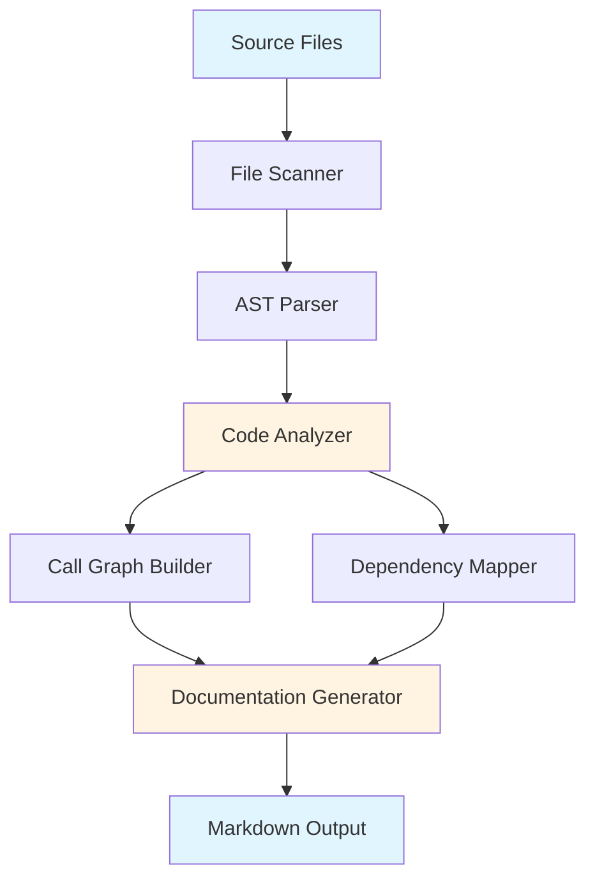
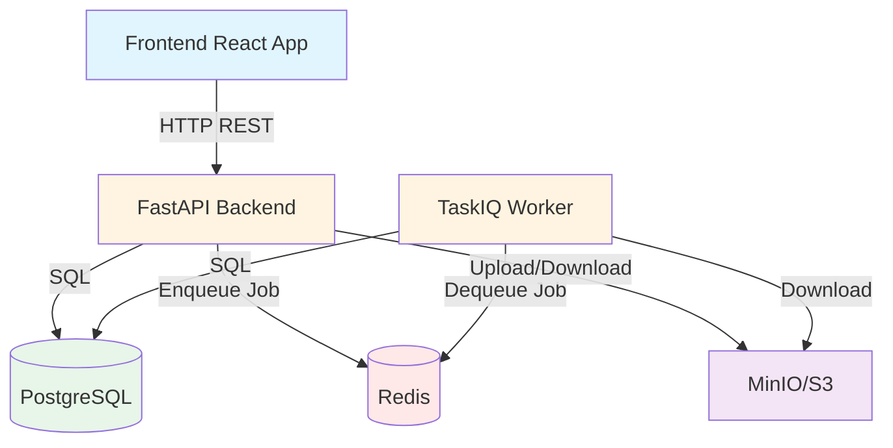
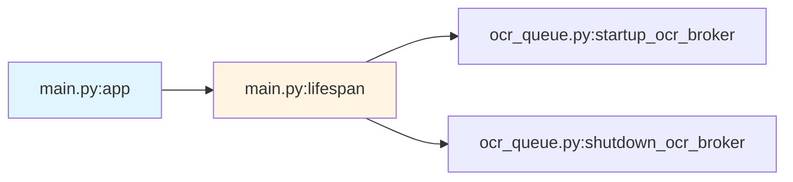

# Design Document: Architecture Analysis & Documentation System

## Overview

Architecture Analysis & Documentation System là một công cụ phân tích tĩnh (static analysis tool) được thiết kế để tự động tạo tài liệu kiến trúc chi tiết cho backend của Personal Finance Analyzer. Hệ thống sử dụng Python AST (Abstract Syntax Tree) để parse và phân tích source code, trích xuất thông tin về functions, classes, dependencies, và call relationships, sau đó tạo ra một file markdown có cấu trúc với Mermaid diagrams.

### Design Goals

1. **Comprehensive Coverage**: Phân tích 100% Python files trong phạm vi đã định (api, worker, shared)
2. **Accuracy**: Trích xuất chính xác signatures, type hints, và docstrings từ AST
3. **Readability**: Tạo documentation dễ đọc, dễ navigate với table of contents và anchor links
4. **Maintainability**: Code analyzer có cấu trúc rõ ràng, dễ mở rộng cho các loại phân tích mới
5. **Performance**: Xử lý toàn bộ codebase trong vài giây (< 5s cho ~50 files)

### Key Design Decisions

**Decision 1: Sử dụng Python AST thay vì regex parsing**
- **Rationale**: AST cung cấp cấu trúc chính xác của code, không bị lỗi với edge cases như strings chứa keywords
- **Tradeoff**: Phức tạp hơn regex nhưng đảm bảo độ chính xác cao

**Decision 2: Single-pass analysis với visitor pattern**
- **Rationale**: Traverse AST một lần duy nhất để thu thập tất cả thông tin cần thiết
- **Tradeoff**: Cần thiết kế visitor cẩn thận để không bỏ sót thông tin

**Decision 3: In-memory data structures thay vì database**
- **Rationale**: Codebase size nhỏ (~50 files), không cần persistence
- **Tradeoff**: Không scale cho codebase lớn (>1000 files) nhưng đủ cho use case hiện tại

**Decision 4: Mermaid diagrams thay vì GraphViz**
- **Rationale**: Mermaid được GitHub và nhiều markdown viewers hỗ trợ native
- **Tradeoff**: Ít tùy chỉnh hơn GraphViz nhưng dễ integrate hơn

## Architecture

### High-Level Components



### Component Responsibilities

1. **File Scanner**: Tìm tất cả Python files trong phạm vi, loại trừ test/cache files
2. **AST Parser**: Parse từng file thành AST, xử lý syntax errors
3. **Code Analyzer**: Traverse AST để trích xuất functions, classes, imports
4. **Call Graph Builder**: Phân tích function calls để tạo call graph
5. **Dependency Mapper**: Map external dependencies và environment variables
6. **Documentation Generator**: Tạo markdown output với Mermaid diagrams

### Data Flow

1. Scanner → danh sách file paths
2. Parser → AST trees cho mỗi file
3. Analyzer → structured data (FileInfo objects)
4. Call Graph Builder → graph structure (caller → callees)
5. Dependency Mapper → dependency matrix
6. Generator → final markdown document

## Components and Interfaces

### 1. File Scanner

**Purpose**: Tìm tất cả Python source files trong phạm vi phân tích

```python
class FileScanner:
    def __init__(self, root_paths: list[Path], exclusions: list[str]):
        """
        Args:
            root_paths: Danh sách thư mục gốc cần scan (api, worker, shared)
            exclusions: Patterns để loại trừ (tests, __pycache__, .venv, etc.)
        """
        
    def scan(self) -> list[Path]:
        """Scan và trả về danh sách Python files.
        
        Returns:
            Sorted list of Path objects pointing to .py files
        """
```

**Algorithm**:
- Sử dụng `pathlib.Path.rglob("**/*.py")` để tìm tất cả .py files
- Filter out files matching exclusion patterns
- Sort theo path để đảm bảo deterministic output

### 2. AST Parser

**Purpose**: Parse Python source files thành Abstract Syntax Trees

```python
class ASTParser:
    def parse_file(self, file_path: Path) -> ast.Module | None:
        """Parse một Python file thành AST.
        
        Args:
            file_path: Path to Python source file
            
        Returns:
            ast.Module nếu parse thành công, None nếu có syntax error
            
        Side Effects:
            Log warning nếu file có syntax error
        """
```

**Error Handling**:
- Catch `SyntaxError` khi parse
- Log file path và error message
- Return None để analyzer có thể skip file đó
- Không crash toàn bộ process vì một file lỗi

### 3. Code Analyzer

**Purpose**: Traverse AST để trích xuất thông tin về functions, classes, imports

```python
@dataclass
class FunctionInfo:
    name: str
    signature: str  # Full signature với type hints
    return_type: str | None
    docstring: str | None
    line_number: int
    is_async: bool
    decorators: list[str]
    
@dataclass
class ClassInfo:
    name: str
    bases: list[str]  # Base classes
    docstring: str | None
    line_number: int
    methods: list[FunctionInfo]
    
@dataclass
class ImportInfo:
    module: str  # e.g., "fastapi"
    names: list[str]  # e.g., ["FastAPI", "Depends"]
    is_from_import: bool
    
@dataclass
class FileInfo:
    path: Path
    module_name: str  # e.g., "app.api.v1.auth"
    functions: list[FunctionInfo]
    classes: list[ClassInfo]
    imports: list[ImportInfo]
    module_docstring: str | None
```

```python
class CodeAnalyzer(ast.NodeVisitor):
    """AST visitor để trích xuất thông tin từ Python code."""
    
    def __init__(self):
        self.current_file: FileInfo | None = None
        self.current_class: ClassInfo | None = None
        
    def analyze_file(self, file_path: Path, tree: ast.Module) -> FileInfo:
        """Analyze một file và trả về FileInfo.
        
        Args:
            file_path: Path to source file
            tree: Parsed AST
            
        Returns:
            FileInfo object chứa tất cả thông tin trích xuất được
        """
        
    def visit_FunctionDef(self, node: ast.FunctionDef) -> None:
        """Extract function information."""
        
    def visit_AsyncFunctionDef(self, node: ast.AsyncFunctionDef) -> None:
        """Extract async function information."""
        
    def visit_ClassDef(self, node: ast.ClassDef) -> None:
        """Extract class information."""
        
    def visit_Import(self, node: ast.Import) -> None:
        """Extract import statements."""
        
    def visit_ImportFrom(self, node: ast.ImportFrom) -> None:
        """Extract from...import statements."""
```

**Key Algorithms**:

1. **Signature Extraction**:
   - Traverse `node.args` để lấy parameters
   - Extract type hints từ `arg.annotation`
   - Format theo PEP 8: `def func(param: Type) -> ReturnType`

2. **Docstring Extraction**:
   - Lấy `ast.get_docstring(node)`
   - Normalize whitespace và indentation

3. **Decorator Extraction**:
   - Traverse `node.decorator_list`
   - Convert AST nodes thành strings (e.g., "@router.get")

### 4. Call Graph Builder

**Purpose**: Phân tích function calls để tạo call graph

```python
@dataclass
class CallRelationship:
    caller: str  # "module.function"
    callee: str  # "module.function"
    call_type: Literal["direct", "method", "imported"]
    
class CallGraphBuilder(ast.NodeVisitor):
    """Visitor để phân tích function calls."""
    
    def __init__(self, file_infos: dict[str, FileInfo]):
        self.file_infos = file_infos
        self.relationships: list[CallRelationship] = []
        self.current_function: str | None = None
        
    def build_graph(self) -> list[CallRelationship]:
        """Build call graph từ tất cả files.
        
        Returns:
            List of CallRelationship objects
        """
        
    def visit_Call(self, node: ast.Call) -> None:
        """Extract function call information."""
```

**Algorithm**:
- Traverse AST của mỗi file
- Khi gặp `ast.Call` node, xác định callee:
  - Nếu là `Name` node: direct call (e.g., `func()`)
  - Nếu là `Attribute` node: method call (e.g., `obj.method()`)
- Resolve callee name dựa trên imports
- Tạo CallRelationship từ current_function đến callee

**Limitations**:
- Không phân tích được dynamic calls (e.g., `getattr(obj, name)()`)
- Không resolve được calls qua variables (e.g., `f = func; f()`)
- Chỉ phân tích static calls có thể xác định được tại parse time

### 5. Dependency Mapper

**Purpose**: Map external dependencies và environment variables

```python
@dataclass
class DependencyInfo:
    file_path: str
    external_libraries: set[str]  # e.g., {"fastapi", "sqlmodel"}
    database_operations: list[str]  # e.g., ["session.exec", "create_engine"]
    external_apis: list[str]  # e.g., ["S3", "Redis"]
    env_variables: set[str]  # e.g., {"DATABASE_URL", "REDIS_URL"}
    
class DependencyMapper:
    def __init__(self, file_infos: dict[str, FileInfo]):
        self.file_infos = file_infos
        
    def map_dependencies(self) -> list[DependencyInfo]:
        """Map dependencies cho tất cả files.
        
        Returns:
            List of DependencyInfo objects
        """
        
    def _is_external_library(self, module: str) -> bool:
        """Check nếu module là external library (không phải local code)."""
        
    def _extract_env_variables(self, tree: ast.Module) -> set[str]:
        """Extract environment variables từ os.getenv calls."""
```

**Algorithm**:

1. **External Libraries Detection**:
   - Lấy tất cả imports từ FileInfo
   - Filter imports không phải local modules (không bắt đầu với "app", "pfa_shared", etc.)
   - Lấy top-level package name (e.g., "fastapi.middleware" → "fastapi")

2. **Database Operations Detection**:
   - Search cho patterns: "session.exec", "session.get", "create_engine", "select("
   - Sử dụng regex hoặc AST traversal

3. **External APIs Detection**:
   - Search cho keywords: "S3", "Redis", "MinIO", "boto3"
   - Detect từ imports và function calls

4. **Environment Variables Extraction**:
   - Traverse AST tìm `os.getenv` calls
   - Extract string literal từ first argument

### 6. Documentation Generator

**Purpose**: Tạo markdown output với Mermaid diagrams

```python
class DocumentationGenerator:
    def __init__(
        self,
        file_infos: dict[str, FileInfo],
        call_relationships: list[CallRelationship],
        dependencies: list[DependencyInfo],
    ):
        self.file_infos = file_infos
        self.call_relationships = call_relationships
        self.dependencies = dependencies
        
    def generate(self, output_path: Path) -> None:
        """Generate markdown documentation.
        
        Args:
            output_path: Path to output markdown file
        """
        
    def _generate_toc(self) -> str:
        """Generate table of contents với anchor links."""
        
    def _generate_architecture_diagram(self) -> str:
        """Generate Mermaid architecture diagram."""
        
    def _generate_file_details(self) -> str:
        """Generate chi tiết từng file với functions và classes."""
        
    def _generate_call_graph(self) -> str:
        """Generate Mermaid call graph diagram."""
        
    def _generate_dependency_matrix(self) -> str:
        """Generate dependency matrix table."""
```

**Output Structure**:

```markdown
# Backend Architecture Documentation

## Table of Contents
- [Architecture Overview](#architecture-overview)
- [File Summary](#file-summary)
- [Detailed Analysis](#detailed-analysis)
- [Call Graph](#call-graph)
- [Dependencies Matrix](#dependencies-matrix)

## Architecture Overview
[Mermaid diagram showing components]

## File Summary
| File | Functions | Classes | LOC |
|------|-----------|---------|-----|
| ... | ... | ... | ... |

## Detailed Analysis

### backend/api/app/main.py
**Module Docstring**: ...

#### Functions
##### `lifespan(app: FastAPI) -> AsyncIterator[None]`
**Line**: 20
**Type**: async context manager
**Docstring**: ...

#### Classes
[None]

#### Imports
- fastapi: FastAPI, ...
- app.core.config: get_settings

---

## Call Graph
[Mermaid flowchart showing function calls]

## Dependencies Matrix
| File | External Libraries | Database | External APIs | Env Variables |
|------|-------------------|----------|---------------|---------------|
| ... | ... | ... | ... | ... |
```

## Data Models

### Core Data Structures

```python
# Đã định nghĩa ở Components section:
# - FunctionInfo
# - ClassInfo
# - ImportInfo
# - FileInfo
# - CallRelationship
# - DependencyInfo

# Main orchestrator data structure:
@dataclass
class AnalysisResult:
    """Kết quả phân tích toàn bộ codebase."""
    file_infos: dict[str, FileInfo]  # key: module_name
    call_relationships: list[CallRelationship]
    dependencies: list[DependencyInfo]
    errors: list[tuple[Path, str]]  # Files không parse được
```

### Type Hints Strategy

- Sử dụng Python 3.12+ type hints với `|` syntax thay vì `Union`
- Sử dụng `list`, `dict`, `set` thay vì `List`, `Dict`, `Set` từ typing
- Sử dụng `dataclass` với `frozen=True` cho immutable data structures
- Sử dụng `Literal` cho enums nhỏ (e.g., call_type)

## Error Handling

### Error Categories

1. **File System Errors**:
   - File không tồn tại
   - Permission denied
   - **Handling**: Log error, skip file, continue processing

2. **Syntax Errors**:
   - Python file có syntax error
   - **Handling**: Log file path và error, skip file, ghi vào `errors` list

3. **AST Traversal Errors**:
   - Unexpected AST node structure
   - **Handling**: Log warning, skip node, continue traversal

4. **Output Generation Errors**:
   - Không thể write output file
   - **Handling**: Raise exception với clear error message

### Error Reporting

```python
@dataclass
class AnalysisError:
    file_path: Path
    error_type: Literal["syntax", "permission", "unexpected"]
    message: str
    
# Trong output markdown, thêm section:
## Analysis Errors
| File | Error Type | Message |
|------|------------|---------|
| ... | ... | ... |
```

### Graceful Degradation

- Một file lỗi không làm crash toàn bộ analysis
- Call graph có thể incomplete nếu một số files không parse được
- Dependencies matrix có thể thiếu entries cho files lỗi
- Output vẫn được generate với thông tin available

## Testing Strategy

### Unit Tests

**Test Coverage Areas**:

1. **FileScanner Tests**:
   - Test với directory structure giả
   - Verify exclusion patterns hoạt động đúng
   - Test edge cases: empty directory, no Python files

2. **ASTParser Tests**:
   - Test parse valid Python files
   - Test handle syntax errors gracefully
   - Test với various Python syntax features

3. **CodeAnalyzer Tests**:
   - Test extract functions với type hints
   - Test extract classes với methods
   - Test extract imports (import và from...import)
   - Test extract docstrings
   - Test extract decorators

4. **CallGraphBuilder Tests**:
   - Test detect direct function calls
   - Test detect method calls
   - Test resolve imported functions
   - Test handle unknown callees

5. **DependencyMapper Tests**:
   - Test identify external libraries
   - Test extract environment variables
   - Test detect database operations
   - Test detect external APIs

6. **DocumentationGenerator Tests**:
   - Test generate valid markdown
   - Test generate valid Mermaid syntax
   - Test table formatting
   - Test anchor links

### Integration Tests

1. **End-to-End Test**:
   - Tạo mini codebase với 3-5 files
   - Run full analysis pipeline
   - Verify output markdown có đầy đủ sections
   - Verify Mermaid diagrams có valid syntax

2. **Real Codebase Test**:
   - Run analyzer trên actual backend codebase
   - Verify không có crashes
   - Verify output có reasonable size
   - Manual review output quality

### Test Data

```python
# Example test file for CodeAnalyzer:
TEST_CODE = '''
"""Module docstring."""
from typing import Optional
import os

def greet(name: str, age: int = 18) -> str:
    """Greet a person."""
    return f"Hello {name}, age {age}"

class Person:
    """A person class."""
    
    def __init__(self, name: str):
        self.name = name
        
    async def fetch_data(self) -> dict:
        """Fetch data asynchronously."""
        return {}
'''
```

### Testing Tools

- **pytest**: Test runner
- **pytest-cov**: Coverage measurement (target: >90%)
- **tempfile**: Tạo temporary directories cho FileScanner tests
- **ast**: Verify generated AST structures

### Manual Testing Checklist

- [ ] Run analyzer trên backend codebase
- [ ] Open output markdown trong GitHub
- [ ] Verify Mermaid diagrams render correctly
- [ ] Click anchor links để verify navigation
- [ ] Check dependencies matrix có đầy đủ thông tin
- [ ] Verify không có files bị missing (compare với actual file count)

## Implementation Notes

### Libraries và Tools

**Standard Library**:
- `ast`: AST parsing và traversal
- `pathlib`: File system operations
- `dataclasses`: Data structures
- `typing`: Type hints
- `logging`: Error logging

**No External Dependencies**: Toàn bộ analyzer sử dụng Python standard library để tránh dependency conflicts

### Performance Considerations

1. **File I/O**:
   - Read files một lần duy nhất
   - Không cache file contents (memory efficient)

2. **AST Traversal**:
   - Single-pass visitor pattern
   - Không traverse AST nhiều lần cho cùng file

3. **Memory Usage**:
   - Sử dụng generators khi có thể
   - Không load toàn bộ codebase vào memory cùng lúc
   - Expected memory: ~50MB cho 50 files

4. **Execution Time**:
   - Target: < 5 seconds cho 50 files
   - Bottleneck: AST parsing (~80% time)
   - Không cần optimization thêm cho use case hiện tại

### Extensibility

**Future Enhancements**:

1. **Type Checking Integration**:
   - Integrate với mypy để verify type hints
   - Report type errors trong documentation

2. **Complexity Metrics**:
   - Calculate cyclomatic complexity
   - Identify complex functions cần refactoring

3. **Test Coverage Mapping**:
   - Map test files với source files
   - Report coverage gaps

4. **Interactive Visualization**:
   - Generate HTML với interactive diagrams
   - Clickable call graph

5. **Incremental Analysis**:
   - Only re-analyze changed files
   - Cache analysis results

### Configuration

```python
@dataclass
class AnalyzerConfig:
    """Configuration cho analyzer."""
    root_paths: list[Path]
    exclusions: list[str]
    output_path: Path
    include_private: bool = False  # Include _private functions
    max_call_graph_depth: int = 5  # Limit call graph depth
    
# Default config:
DEFAULT_CONFIG = AnalyzerConfig(
    root_paths=[
        Path("backend/api/app"),
        Path("backend/worker"),
        Path("backend/shared/pfa_shared"),
    ],
    exclusions=[
        "tests/",
        "__pycache__/",
        ".pytest_cache/",
        ".mypy_cache/",
        ".ruff_cache/",
        ".venv/",
        "alembic/",
    ],
    output_path=Path("docs/backend_architecture.md"),
)
```

### CLI Interface

```python
# analyzer_cli.py
import argparse

def main():
    parser = argparse.ArgumentParser(
        description="Analyze backend architecture and generate documentation"
    )
    parser.add_argument(
        "--output",
        default="docs/backend_architecture.md",
        help="Output markdown file path",
    )
    parser.add_argument(
        "--include-private",
        action="store_true",
        help="Include private functions (_func)",
    )
    args = parser.parse_args()
    
    # Run analysis...
    
if __name__ == "__main__":
    main()
```

### Usage Example

```bash
# Basic usage:
python analyzer_cli.py

# Custom output path:
python analyzer_cli.py --output docs/arch.md

# Include private functions:
python analyzer_cli.py --include-private
```

## Mermaid Diagram Examples

### Architecture Diagram Template



### Call Graph Template



## Next Steps

1. **Implementation Phase**:
   - Implement FileScanner
   - Implement ASTParser
   - Implement CodeAnalyzer với visitor pattern
   - Implement CallGraphBuilder
   - Implement DependencyMapper
   - Implement DocumentationGenerator

2. **Testing Phase**:
   - Write unit tests cho từng component
   - Write integration test
   - Run trên actual codebase và review output

3. **Documentation Phase**:
   - Generate documentation cho backend
   - Review và refine output format
   - Add manual annotations nếu cần

4. **Maintenance**:
   - Re-run analyzer khi có major code changes
   - Update documentation quarterly
   - Integrate vào CI/CD pipeline (optional)


## Correctness Properties

*A property is a characteristic or behavior that should hold true across all valid executions of a system—essentially, a formal statement about what the system should do. Properties serve as the bridge between human-readable specifications and machine-verifiable correctness guarantees.*

### Property Reflection

After analyzing all acceptance criteria, I identified the following properties that need testing. Some criteria were combined to avoid redundancy:

**Combined Properties**:
- Properties 2.1, 2.2, 2.3, 2.4 all relate to extraction completeness → combined into Property 1 (Extraction Completeness)
- Properties 3.1, 3.2, 3.3 all relate to call graph generation → combined into Property 2 (Call Graph Completeness)
- Properties 6.1, 6.2-6.6 relate to file scanning and filtering → combined into Property 3 (File Scanning Correctness)
- Properties 8.3, 8.4 relate to AST extraction → covered by Property 1
- Property 8.6 is a critical invariant → Property 6 (Read-Only Invariant)

**Redundancy Eliminated**:
- Property 2.7 (data structure hierarchy) is implied by Property 1 (if extraction is complete and correct, structure follows)
- Property 8.1 (parsing valid files) is covered by Property 4 (parsing round-trip)
- Properties about output format (5.x, 7.x) are example-based tests, not properties

### Property 1: Extraction Completeness

*For any* valid Python source file containing functions, classes, and imports, the analyzer SHALL extract all top-level functions, all classes with their methods, all function signatures with type hints, and all docstrings without omission.

**Validates: Requirements 2.1, 2.2, 2.3, 2.4, 8.3, 8.4**

### Property 2: Call Graph Completeness

*For any* set of Python files with function calls (both intra-file and inter-file), the call graph builder SHALL capture all static function call relationships where the callee can be determined at parse time, including direct calls, method calls, and calls to imported functions.

**Validates: Requirements 3.1, 3.2, 3.3**

### Property 3: File Scanning Correctness

*For any* directory structure containing Python files, the file scanner SHALL include all `.py` files within specified root paths AND exclude all files matching exclusion patterns (tests/, __pycache__/, .venv/, etc.), ensuring no false positives or false negatives.

**Validates: Requirements 6.1, 6.2, 6.3, 6.4, 6.5, 6.6**

### Property 4: AST Parsing Robustness

*For any* Python source file (valid or invalid), the AST parser SHALL either successfully parse the file into an AST or gracefully handle syntax errors by logging the error and returning None, without crashing the analysis process.

**Validates: Requirements 8.1, 8.2**

### Property 5: External Dependency Identification

*For any* Python file with import statements, the dependency mapper SHALL correctly classify each import as either an external library (not part of the analyzed codebase) or an internal module, and extract all environment variable names from `os.getenv()` calls.

**Validates: Requirements 4.1, 4.4**

### Property 6: Read-Only Invariant

*For any* valid Python source file, running the analyzer SHALL complete without modifying the source file content, preserving the original file hash before and after analysis.

**Validates: Requirements 8.6**

### Property 7: Signature Formatting Consistency

*For any* function definition with parameters and return type annotations, the pretty printer SHALL format the signature according to PEP 8 conventions with consistent spacing and type hint formatting.

**Validates: Requirements 8.5**

### Property 8: Documentation Structure Invariant

*For any* analysis result, the generated documentation SHALL contain all required sections in the specified order: Table of Contents, Architecture Overview, File Summary, Detailed Analysis, Call Graph, and Dependencies Matrix, with valid markdown syntax throughout.

**Validates: Requirements 5.1, 5.2, 5.3, 5.4, 5.5, 5.6, 5.7**
