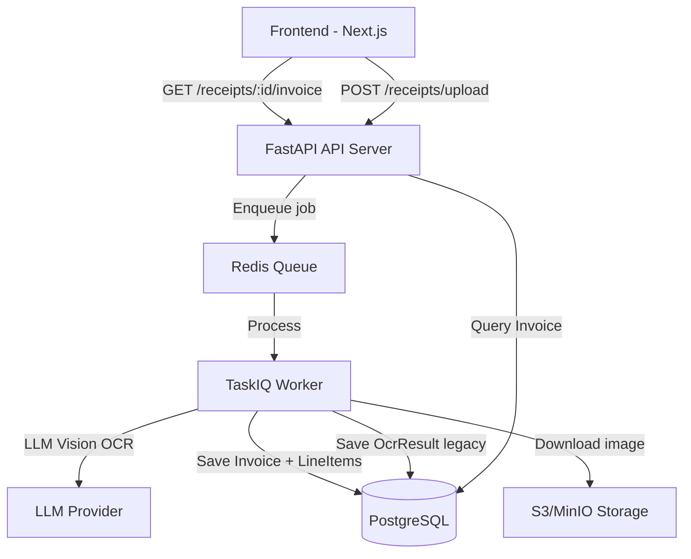

# Design Document: Invoice Data Restructure

## Overview

Tái cấu trúc data model hóa đơn trong Personal Finance Analyzer để hỗ trợ đầy đủ cấu trúc hóa đơn điện tử Việt Nam. Thêm 2 entity mới (`Invoice`, `InvoiceLineItem`) song song với `ReceiptLineItem` hiện tại, cập nhật OCR provider để extract full invoice fields, và mở rộng API + frontend để hiển thị toàn bộ thông tin hóa đơn.

**Design Decisions:**
- Tạo entity mới thay vì alter entity cũ → backward compatible, không cần migrate data cũ
- Invoice liên kết 1-1 với ReceiptUpload (nullable) → receipts cũ vẫn hoạt động
- Worker tạo cả OcrResult (legacy) lẫn Invoice (new) → gradual migration
- OCR normalize prompt mới trả về full Vietnamese e-invoice structure

## Architecture



**Flow thay đổi:**
1. Upload receipt → enqueue OCR job (unchanged)
2. Worker OCR extract → raw text (unchanged)
3. Worker normalize → **OCRInvoiceResult** (new dataclass, replaces OCRNormalizedReceipt for invoice path)
4. Worker saves **Invoice** + **InvoiceLineItem** records (new)
5. Worker still saves OcrResult + ReceiptLineItem (backward compat)
6. API returns Invoice data via new endpoint + enhanced draft endpoint

## Components and Interfaces

### 1. Database Entities (backend/shared/pfa_shared/entities.py)

#### Invoice Entity

```python
class Invoice(SQLModel, table=True):
    __tablename__ = "invoices"

    id: int | None = Field(default=None, primary_key=True)
    receipt_upload_id: int = Field(
        sa_column=Column(
            Integer,
            ForeignKey("receipt_uploads.id", ondelete="CASCADE"),
            nullable=False,
            unique=True,
            index=True,
        ),
    )
    user_id: int = Field(foreign_key="users.id", index=True)

    # Invoice metadata
    invoice_number: str | None = Field(default=None, max_length=100)
    template_symbol: str | None = Field(default=None, max_length=50)
    issue_date: date | None = Field(default=None)
    tax_lookup_code: str | None = Field(default=None, max_length=100)
    currency: str = Field(default="VND", max_length=10)

    # Seller info
    seller_name: str | None = Field(default=None, max_length=255)
    seller_tax_id: str | None = Field(default=None, max_length=20)
    seller_address: str | None = Field(default=None, max_length=500)

    # Buyer info
    buyer_name: str | None = Field(default=None, max_length=255)
    buyer_tax_id: str | None = Field(default=None, max_length=20)
    buyer_address: str | None = Field(default=None, max_length=500)
    payment_method: str | None = Field(default=None, max_length=100)

    # Totals
    subtotal_before_tax: Decimal | None = Field(default=None, sa_column=Column(Numeric(15, 2)))
    total_tax: Decimal | None = Field(default=None, sa_column=Column(Numeric(15, 2)))
    grand_total: Decimal | None = Field(default=None, sa_column=Column(Numeric(15, 2)))
    amount_in_words: str | None = Field(default=None, max_length=500)

    # Authentication / digital signature
    digital_signature: str | None = Field(default=None, max_length=500)
    signing_date: date | None = Field(default=None)
    lookup_link: str | None = Field(default=None, max_length=500)

    created_at: datetime = Field(
        sa_column=Column(DateTime(timezone=True), server_default=func.now(), nullable=False),
    )
```

#### InvoiceLineItem Entity

```python
class InvoiceLineItem(SQLModel, table=True):
    __tablename__ = "invoice_line_items"

    id: int | None = Field(default=None, primary_key=True)
    invoice_id: int = Field(
        sa_column=Column(
            Integer,
            ForeignKey("invoices.id", ondelete="CASCADE"),
            nullable=False,
            index=True,
        ),
    )
    line_number: int = Field(default=0)
    item_name: str = Field(max_length=500)
    unit: str | None = Field(default=None, max_length=50)
    quantity: Decimal = Field(default=Decimal("1"), sa_column=Column(Numeric(10, 3), nullable=False))
    unit_price: Decimal = Field(sa_column=Column(Numeric(15, 2), nullable=False))
    line_total: Decimal = Field(sa_column=Column(Numeric(15, 2), nullable=False))

    # VAT
    vat_rate: Decimal | None = Field(default=None, sa_column=Column(Numeric(5, 2)))
    vat_amount: Decimal | None = Field(default=None, sa_column=Column(Numeric(15, 2)))

    created_at: datetime = Field(
        sa_column=Column(DateTime(timezone=True), server_default=func.now(), nullable=False),
    )
```

### 2. OCR Provider Dataclasses (backend/worker/ocr_provider.py)

New dataclasses for full invoice extraction:

```python
@dataclass(frozen=True, slots=True)
class OCRInvoiceLineItem:
    """Single line item from Vietnamese e-invoice."""
    item_name: str
    unit: str | None
    quantity: Decimal
    unit_price: Decimal
    line_total: Decimal | None  # None → worker calculates quantity * unit_price
    vat_rate: Decimal | None    # e.g. Decimal("10") for 10%
    vat_amount: Decimal | None


@dataclass(frozen=True, slots=True)
class OCRInvoiceResult:
    """Full Vietnamese e-invoice extraction result."""
    # Metadata
    invoice_number: str | None
    template_symbol: str | None
    issue_date: str | None       # ISO "YYYY-MM-DD"
    tax_lookup_code: str | None
    currency: str

    # Seller
    seller_name: str | None
    seller_tax_id: str | None
    seller_address: str | None

    # Buyer
    buyer_name: str | None
    buyer_tax_id: str | None
    buyer_address: str | None
    payment_method: str | None

    # Line items
    line_items: list[OCRInvoiceLineItem]

    # Totals
    subtotal_before_tax: Decimal | None
    total_tax: Decimal | None
    grand_total: Decimal | None
    amount_in_words: str | None

    # Authentication
    digital_signature: str | None
    signing_date: str | None     # ISO "YYYY-MM-DD"
    lookup_link: str | None
```

New LLM prompt for Vietnamese e-invoice:

```python
OCR_INVOICE_NORMALIZE_PROMPT = """Parse the following Vietnamese e-invoice (hóa đơn điện tử) text and return STRICT JSON:
{
  "invoice_number": "string or null",
  "template_symbol": "string or null (ký hiệu mẫu số)",
  "issue_date": "YYYY-MM-DD or null",
  "tax_lookup_code": "string or null (mã tra cứu thuế)",
  "currency": "VND",
  "seller_name": "string or null",
  "seller_tax_id": "string or null (MST người bán)",
  "seller_address": "string or null",
  "buyer_name": "string or null",
  "buyer_tax_id": "string or null (MST người mua)",
  "buyer_address": "string or null",
  "payment_method": "string or null (hình thức thanh toán)",
  "line_items": [
    {
      "item_name": "string",
      "unit": "string or null (đơn vị tính)",
      "quantity": number,
      "unit_price": number,
      "line_total": number or null,
      "vat_rate": number or null (percentage, e.g. 10 for 10%),
      "vat_amount": number or null
    }
  ],
  "subtotal_before_tax": number or null (cộng tiền hàng),
  "total_tax": number or null (tổng tiền thuế),
  "grand_total": number or null (tổng tiền thanh toán),
  "amount_in_words": "string or null (số tiền bằng chữ)",
  "digital_signature": "string or null",
  "signing_date": "YYYY-MM-DD or null",
  "lookup_link": "string or null"
}

Return ONLY the JSON object, no markdown fences, no commentary.

Receipt text:
"""
```

New method on `LLMVisionOCRProvider`:

```python
def normalize_invoice(self, raw: OCRRawResult) -> OCRInvoiceResult:
    """Parse raw text → full Vietnamese e-invoice structure via LLM."""
    ...
```

New parser function:

```python
def _parse_invoice_normalized(data: dict) -> OCRInvoiceResult:
    """Parse dict from LLM response into OCRInvoiceResult with defensive defaults."""
    ...
```

### 3. Worker Task Updates (backend/worker/tasks.py)

Updated `run_ocr_for_receipt` flow:

```python
def run_ocr_for_receipt(session, storage, provider, receipt_id) -> str:
    # ... existing steps 1-3 unchanged ...

    # Step 3.5: Invoice extraction (new)
    invoice_result = provider.normalize_invoice(raw_result)

    # Step 4: Upsert OcrResult (unchanged - backward compat)
    # ...

    # Step 4.5: Save ReceiptLineItems (unchanged - backward compat)
    # ...

    # Step 4.6: Save Invoice + InvoiceLineItems (new)
    _save_invoice(session, receipt_id, receipt.user_id, invoice_result)

    # Step 5: Mark READY (unchanged)
```

New helper:

```python
def _save_invoice(
    session: Session,
    receipt_id: int,
    user_id: int,
    invoice_result: OCRInvoiceResult,
) -> None:
    """Upsert Invoice + InvoiceLineItems (idempotent)."""
    # Delete existing invoice (CASCADE deletes line items)
    existing = session.exec(
        select(Invoice).where(Invoice.receipt_upload_id == receipt_id)
    ).first()
    if existing:
        session.delete(existing)
        session.flush()

    # Create Invoice
    invoice = Invoice(
        receipt_upload_id=receipt_id,
        user_id=user_id,
        invoice_number=invoice_result.invoice_number,
        # ... all fields ...
    )
    session.add(invoice)
    session.flush()  # Get invoice.id

    # Create InvoiceLineItems
    for idx, item in enumerate(invoice_result.line_items):
        line_total = item.line_total or (item.quantity * item.unit_price)
        session.add(InvoiceLineItem(
            invoice_id=invoice.id,
            line_number=idx,
            item_name=item.item_name,
            unit=item.unit,
            quantity=item.quantity,
            unit_price=item.unit_price,
            line_total=line_total,
            vat_rate=item.vat_rate,
            vat_amount=item.vat_amount,
        ))
```

### 4. API Schemas (backend/api/app/schemas/receipts.py)

```python
class InvoiceLineItemResponse(BaseModel):
    model_config = ConfigDict(extra="forbid")

    id: int
    line_number: int
    item_name: str
    unit: str | None
    quantity: Decimal
    unit_price: Decimal
    line_total: Decimal
    vat_rate: Decimal | None
    vat_amount: Decimal | None


class InvoiceResponse(BaseModel):
    model_config = ConfigDict(extra="forbid")

    id: int
    receipt_upload_id: int

    # Metadata
    invoice_number: str | None
    template_symbol: str | None
    issue_date: date | None
    tax_lookup_code: str | None
    currency: str

    # Seller
    seller_name: str | None
    seller_tax_id: str | None
    seller_address: str | None

    # Buyer
    buyer_name: str | None
    buyer_tax_id: str | None
    buyer_address: str | None
    payment_method: str | None

    # Totals
    subtotal_before_tax: Decimal | None
    total_tax: Decimal | None
    grand_total: Decimal | None
    amount_in_words: str | None

    # Authentication
    digital_signature: str | None
    signing_date: date | None
    lookup_link: str | None

    # Nested line items
    line_items: list[InvoiceLineItemResponse]
```

### 5. API Endpoint (backend/api/app/api/v1/receipts.py)

New endpoint:

```python
@router.get("/{receipt_id}/invoice", response_model=InvoiceResponse)
def get_receipt_invoice(
    receipt_id: int,
    session: Session = Depends(get_session),
    current_user: User = Depends(get_current_user),
) -> InvoiceResponse:
    """Return full invoice data with nested line items."""
    receipt = _ensure_receipt_owner(session, receipt_id, current_user.id)
    invoice = session.exec(
        select(Invoice).where(Invoice.receipt_upload_id == receipt_id)
    ).first()
    if invoice is None:
        raise HTTPException(status_code=404, detail="Invoice not found")

    line_items = session.exec(
        select(InvoiceLineItem)
        .where(InvoiceLineItem.invoice_id == invoice.id)
        .order_by(InvoiceLineItem.line_number)
    ).all()

    return InvoiceResponse(
        id=invoice.id,
        receipt_upload_id=invoice.receipt_upload_id,
        # ... map all fields ...
        line_items=[InvoiceLineItemResponse(...) for item in line_items],
    )
```

Updated draft endpoint logic: when Invoice exists, prefer its data over OcrResult normalized_payload for merchant_name, amount, date, currency.

### 6. Frontend Types (frontend/web/lib/receipts-api.ts)

```typescript
export type InvoiceLineItem = {
  id: number;
  line_number: number;
  item_name: string;
  unit: string | null;
  quantity: string;
  unit_price: string;
  line_total: string;
  vat_rate: string | null;
  vat_amount: string | null;
};

export type InvoiceData = {
  id: number;
  receipt_upload_id: number;
  invoice_number: string | null;
  template_symbol: string | null;
  issue_date: string | null;
  tax_lookup_code: string | null;
  currency: string;
  seller_name: string | null;
  seller_tax_id: string | null;
  seller_address: string | null;
  buyer_name: string | null;
  buyer_tax_id: string | null;
  buyer_address: string | null;
  payment_method: string | null;
  subtotal_before_tax: string | null;
  total_tax: string | null;
  grand_total: string | null;
  amount_in_words: string | null;
  digital_signature: string | null;
  signing_date: string | null;
  lookup_link: string | null;
  line_items: InvoiceLineItem[];
};

export async function getReceiptInvoice(receiptId: number): Promise<InvoiceData> {
  return jsonRequest<InvoiceData>(`/api/v1/receipts/${receiptId}/invoice`, { method: "GET" });
}
```

### 7. Table Creation (backend/api/app/main.py)

Add to `_ensure_tables()`:

```sql
CREATE TABLE IF NOT EXISTS invoices (
    id SERIAL PRIMARY KEY,
    receipt_upload_id INTEGER NOT NULL UNIQUE REFERENCES receipt_uploads(id) ON DELETE CASCADE,
    user_id INTEGER NOT NULL REFERENCES users(id),
    invoice_number VARCHAR(100),
    template_symbol VARCHAR(50),
    issue_date DATE,
    tax_lookup_code VARCHAR(100),
    currency VARCHAR(10) NOT NULL DEFAULT 'VND',
    seller_name VARCHAR(255),
    seller_tax_id VARCHAR(20),
    seller_address VARCHAR(500),
    buyer_name VARCHAR(255),
    buyer_tax_id VARCHAR(20),
    buyer_address VARCHAR(500),
    payment_method VARCHAR(100),
    subtotal_before_tax NUMERIC(15, 2),
    total_tax NUMERIC(15, 2),
    grand_total NUMERIC(15, 2),
    amount_in_words VARCHAR(500),
    digital_signature VARCHAR(500),
    signing_date DATE,
    lookup_link VARCHAR(500),
    created_at TIMESTAMP WITH TIME ZONE NOT NULL DEFAULT NOW()
);
CREATE INDEX IF NOT EXISTS ix_invoices_receipt ON invoices(receipt_upload_id);
CREATE INDEX IF NOT EXISTS ix_invoices_user ON invoices(user_id);

CREATE TABLE IF NOT EXISTS invoice_line_items (
    id SERIAL PRIMARY KEY,
    invoice_id INTEGER NOT NULL REFERENCES invoices(id) ON DELETE CASCADE,
    line_number INTEGER NOT NULL DEFAULT 0,
    item_name VARCHAR(500) NOT NULL,
    unit VARCHAR(50),
    quantity NUMERIC(10, 3) NOT NULL DEFAULT 1,
    unit_price NUMERIC(15, 2) NOT NULL,
    line_total NUMERIC(15, 2) NOT NULL,
    vat_rate NUMERIC(5, 2),
    vat_amount NUMERIC(15, 2),
    created_at TIMESTAMP WITH TIME ZONE NOT NULL DEFAULT NOW()
);
CREATE INDEX IF NOT EXISTS ix_invoice_line_items_invoice ON invoice_line_items(invoice_id);
```

## Data Models

### Entity Relationship

```mermaid
erDiagram
    User ||--o{ ReceiptUpload : owns
    User ||--o{ Invoice : owns
    ReceiptUpload ||--o| OcrResult : has
    ReceiptUpload ||--o{ ReceiptLineItem : has_legacy
    ReceiptUpload ||--o| Invoice : has_new
    Invoice ||--o{ InvoiceLineItem : contains

    Invoice {
        int id PK
        int receipt_upload_id FK UK
        int user_id FK
        string invoice_number
        string template_symbol
        date issue_date
        string tax_lookup_code
        string currency
        string seller_name
        string seller_tax_id
        string seller_address
        string buyer_name
        string buyer_tax_id
        string buyer_address
        string payment_method
        decimal subtotal_before_tax
        decimal total_tax
        decimal grand_total
        string amount_in_words
        string digital_signature
        date signing_date
        string lookup_link
        datetime created_at
    }

    InvoiceLineItem {
        int id PK
        int invoice_id FK
        int line_number
        string item_name
        string unit
        decimal quantity
        decimal unit_price
        decimal line_total
        decimal vat_rate
        decimal vat_amount
        datetime created_at
    }
```

### Migration Strategy

- New tables (`invoices`, `invoice_line_items`) created via `_ensure_tables()` on app startup
- Existing tables (`receipt_line_items`, `ocr_results`) remain untouched
- Worker creates records in both old and new tables for backward compatibility
- API prefers Invoice data when available, falls back to OcrResult
- No data migration needed for existing receipts

## Correctness Properties

*A property is a characteristic or behavior that should hold true across all valid executions of a system — essentially, a formal statement about what the system should do. Properties serve as the bridge between human-readable specifications and machine-verifiable correctness guarantees.*

### Property 1: Invoice persistence round-trip

*For any* valid Invoice with any combination of non-null fields and any number of InvoiceLineItems (each with valid line_number, item_name, unit, quantity, unit_price, line_total, vat_rate, vat_amount), persisting to the database and reading back should produce an equivalent Invoice with all fields matching and line items in correct order.

**Validates: Requirements 1.1, 1.2, 1.3, 1.4, 1.5, 2.1, 2.2, 2.4**

### Property 2: line_total auto-calculation

*For any* InvoiceLineItem where line_total is None in the OCR result, the worker SHALL set line_total to exactly quantity × unit_price. For items where line_total IS provided, the original value is preserved.

**Validates: Requirements 2.5**

### Property 3: OCR parser resilience with partial data

*For any* JSON dict with an arbitrary subset of invoice fields missing (null or absent), the `_parse_invoice_normalized` function SHALL return a valid OCRInvoiceResult with null for missing fields, without raising any exception.

**Validates: Requirements 3.7**

### Property 4: Worker saves complete Invoice structure from OCR output

*For any* valid OCRInvoiceResult, after the worker processes it, the database SHALL contain exactly one Invoice record with fields matching the OCR output AND exactly N InvoiceLineItem records (where N = len(ocr_result.line_items)) with matching fields, AND an OcrResult record SHALL also exist for backward compatibility.

**Validates: Requirements 4.1, 4.2, 4.5**

### Property 5: Worker idempotency on re-processing

*For any* receipt that has been processed twice with different OCRInvoiceResult data, the database SHALL contain only the Invoice and InvoiceLineItems from the second (latest) processing run. No data from the first run persists.

**Validates: Requirements 4.3**

### Property 6: API prefers Invoice data over OcrResult

*For any* receipt that has both an OcrResult and an Invoice record (with potentially different values for merchant/amount/date), the draft API endpoint SHALL return values from the Invoice record (seller_name as merchant, grand_total as amount, issue_date as date).

**Validates: Requirements 7.3**

## Error Handling

| Scenario | Behavior |
|----------|----------|
| OCR LLM returns invalid JSON for invoice | `_parse_invoice_normalized` returns all-null OCRInvoiceResult; worker still saves Invoice with null fields |
| OCR LLM timeout | Worker catches exception, marks receipt FAILED, no partial Invoice created |
| Invoice FK violation (receipt_upload_id not found) | DB raises IntegrityError, worker catches and marks FAILED |
| API request for receipt without Invoice | Returns 404 on `/invoice` endpoint; draft endpoint falls back to OcrResult data |
| Null fields in Invoice | API returns null in JSON; frontend displays placeholder |
| CASCADE delete of ReceiptUpload | Automatically deletes Invoice and InvoiceLineItems |

## Testing Strategy

### Unit Tests
- `_parse_invoice_normalized`: test with complete, partial, and empty JSON dicts
- `_save_invoice`: test with mock session, verify correct entities created
- API endpoint: test 404, auth check, response structure
- line_total calculation: test null vs provided values

### Property-Based Tests (using Hypothesis)
- **Property 1**: Generate random Invoice + LineItems, persist, read back, assert equality
- **Property 2**: Generate random (quantity, unit_price) pairs, verify line_total calculation
- **Property 3**: Generate random subsets of invoice fields, run parser, assert no exception and valid return type
- **Property 4**: Generate random OCRInvoiceResult, run worker save logic, verify DB state
- **Property 5**: Generate two different OCRInvoiceResults, run worker twice, verify only latest persists
- **Property 6**: Generate Invoice and OcrResult with different values, call draft builder, verify Invoice values returned

**Configuration:**
- Library: `hypothesis` (Python PBT standard)
- Minimum 100 iterations per property test
- Tag format: `Feature: invoice-data-restructure, Property {N}: {title}`

### Integration Tests
- OCR extraction with sample Vietnamese invoice images (2-3 examples)
- Full pipeline: upload → worker → API response
- Frontend component rendering with mock invoice data
