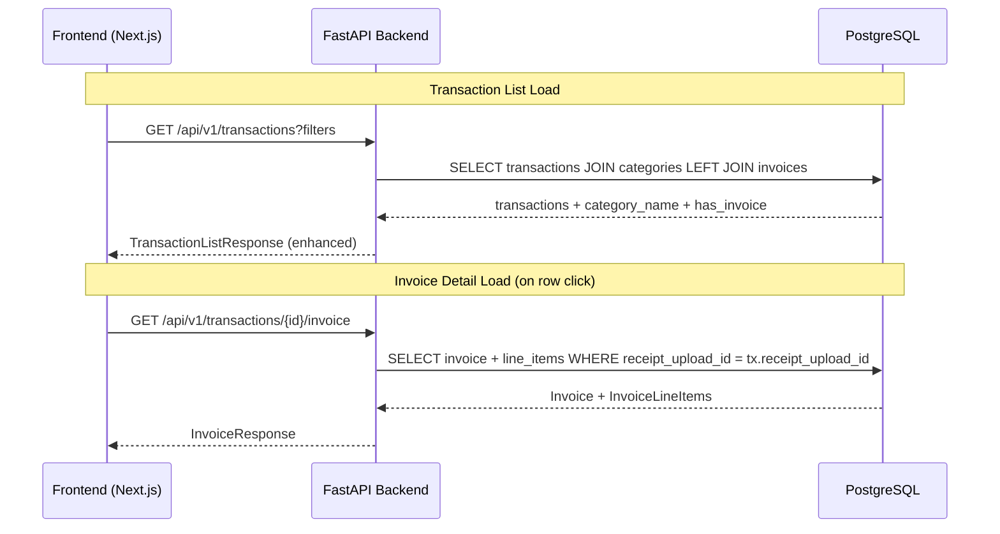

# Design Document: Transaction UI Redesign

## Overview

This feature enhances the transaction list page to display invoice indicators and category names, adds an inline detail view for viewing full Vietnamese e-invoice data, and adds a backend endpoint to fetch invoice data by transaction ID. The design reuses the existing `InvoiceResponse` schema and follows the same patterns established in the receipts API.

## Architecture



The architecture adds:
1. A new `GET /transactions/{id}/invoice` endpoint that resolves transaction → receipt → invoice
2. Enhanced list response with `has_invoice` boolean and `category_name` string (computed via JOIN)
3. Frontend inline expand pattern for detail view with lazy-loaded invoice data

## Components and Interfaces

### Backend

**New Endpoint:** `GET /api/v1/transactions/{id}/invoice`
- Reuses existing `InvoiceResponse` schema from `app/schemas/receipts.py`
- Ownership check: verifies `transaction.user_id == current_user.id`
- Resolves chain: transaction → receipt_upload_id → Invoice → InvoiceLineItems

**Enhanced List Endpoint:** `GET /api/v1/transactions`
- Adds `has_invoice: bool` to each item (subquery: EXISTS invoice for receipt_upload_id)
- Adds `category_name: str | None` (LEFT JOIN categories)

**Schema Changes:**
- `TransactionResponse` → add `has_invoice: bool` and `category_name: str | None`

### Frontend

**Updated `transactions-api.ts`:**
- Add `has_invoice` and `category_name` fields to `Transaction` type
- Add `getTransactionInvoice(transactionId: number)` function

**Updated `transaction-history-client.tsx`:**
- Add invoice indicator badge in table rows
- Add category name column
- Add expandable detail row with invoice display
- Add loading/error states for invoice fetch

## Data Models

### Enhanced TransactionResponse Schema

```python
class TransactionResponse(BaseModel):
    id: int
    user_id: int
    category_id: int | None
    category_name: str | None        # NEW: resolved from categories table
    receipt_upload_id: int | None
    has_invoice: bool                 # NEW: EXISTS check on invoices table
    merchant_name: str | None
    amount: Decimal
    currency: str
    transaction_date: date
    note: str | None
    created_at: datetime
```

### Frontend Transaction Type

```typescript
export type Transaction = {
  id: number;
  user_id: number;
  category_id: number | null;
  category_name: string | null;      // NEW
  receipt_upload_id: number | null;
  has_invoice: boolean;              // NEW
  merchant_name: string | null;
  amount: string;
  currency: string;
  transaction_date: string;
  note: string | null;
  created_at: string;
};
```

## Correctness Properties

*A property is a characteristic or behavior that should hold true across all valid executions of a system — essentially, a formal statement about what the system should do. Properties serve as the bridge between human-readable specifications and machine-verifiable correctness guarantees.*

### Property 1: has_invoice field correctness

*For any* set of transactions returned by the list endpoint, the `has_invoice` field for each transaction SHALL be `true` if and only if an Invoice entity exists in the database for that transaction's `receipt_upload_id`.

**Validates: Requirements 2.1**

### Property 2: category_name resolution correctness

*For any* transaction with a non-null `category_id`, the `category_name` field in the list response SHALL equal the `name` field of the Category entity with that ID. For transactions with null `category_id`, `category_name` SHALL be null.

**Validates: Requirements 6.1**

### Property 3: Invoice detail view renders all required fields

*For any* valid InvoiceData object, the transaction detail view SHALL render all non-null fields including: invoice metadata (number, template, date, lookup code, currency), seller info (name, tax ID, address), buyer info (name, tax ID, address, payment method), all line items (name, unit, quantity, unit price, line total, VAT rate, VAT amount), and totals (subtotal, tax, grand total, amount in words).

**Validates: Requirements 3.2, 3.3, 3.4, 3.5, 3.6, 3.7**

### Property 4: Idempotent transaction creation from OCR

*For any* receipt that already has an associated Transaction, running the OCR worker again SHALL NOT create a duplicate Transaction — the existing transaction remains unchanged and no new transaction is added.

**Validates: Requirements 4.4**

## Error Handling

| Scenario | Backend Response | Frontend Behavior |
|----------|-----------------|-------------------|
| Transaction not found or not owned | 404 "Transaction not found" | Show error in detail area |
| Transaction has no receipt | 404 "Invoice not found" | Show basic details only |
| Receipt has no invoice | 404 "Invoice not found" | Show basic details only |
| Database error during list | 500 | Show error banner, keep filter state |
| Network error loading invoice | Timeout/error | Show error message in detail row |

## Testing Strategy

**Unit Tests (example-based):**
- Endpoint returns 404 when transaction not owned by user
- Endpoint returns 404 when no invoice exists
- Detail view shows basic info for transactions without invoice
- Loading indicator appears while fetching
- Error message displays on fetch failure

**Property Tests (PBT with `hypothesis` for Python, `fast-check` for TypeScript):**
- Property 1: has_invoice correctness — generate random transaction sets with/without invoices
- Property 2: category_name resolution — generate transactions with various category assignments
- Property 4: Idempotent OCR transaction creation — run worker multiple times on same receipt

**Integration Tests:**
- Full OCR flow creates transaction visible in list with has_invoice=true
- GET /transactions/{id}/invoice returns same schema as GET /receipts/{id}/invoice

**Configuration:**
- Minimum 100 iterations per property test
- Tag format: `Feature: transaction-ui-redesign, Property {N}: {title}`
