# API Design Review

Tài liệu này mô tả API design hiện tại của Personal Finance Analyzer để dễ phân tích lại logic, boundary và hướng refactor tiếp theo.

## 1. High-level Architecture

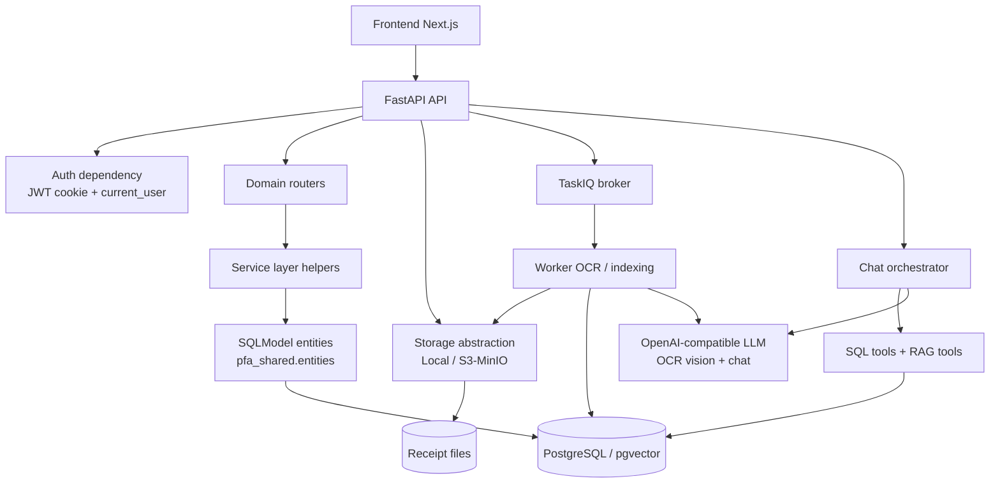

Current shape:

- FastAPI is the main backend process.
- Routers are grouped by product domain.
- SQLModel entities live in `backend/shared/pfa_shared/entities.py` and are reused by API + worker.
- Worker handles OCR, invoice extraction, receipt text indexing, and some automatic transaction creation.
- Frontend calls API only; it does not call OCR/LLM/storage directly.

## 2. API Router Map

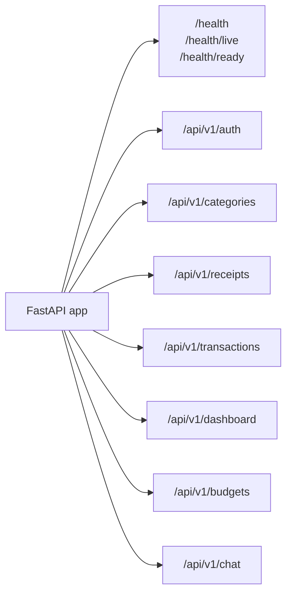

Main files:

- `backend/api/app/main.py`
- `backend/api/app/api/v1/auth.py`
- `backend/api/app/api/v1/categories.py`
- `backend/api/app/api/v1/receipts.py`
- `backend/api/app/api/v1/transactions.py`
- `backend/api/app/api/v1/dashboard.py`
- `backend/api/app/api/v1/budgets.py`
- `backend/api/app/api/v1/chat.py`

## 3. Request Lifecycle

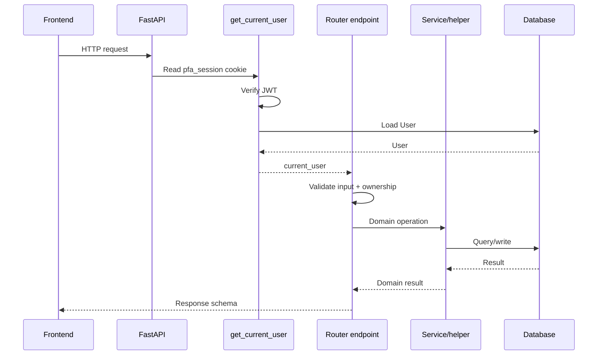

Key point: most protected endpoints rely on `current_user: User = Depends(get_current_user)`.

## 4. Source-of-truth Boundaries

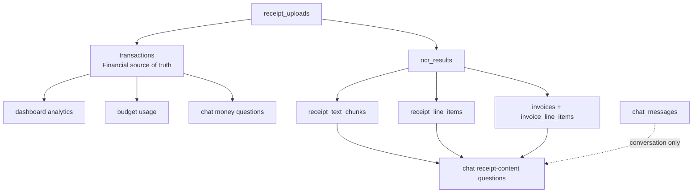

Rules:

- Money reports read from `transactions`.
- `receipt_uploads`, `ocr_results`, receipt items, invoices are input/review/debug/detail data.
- `receipt_text_chunks` is search support, not financial truth.
- `chat_messages` stores conversation history only.

## 5. Auth API

Endpoints:

```text
POST /api/v1/auth/register
POST /api/v1/auth/login
GET  /api/v1/auth/me
POST /api/v1/auth/logout
```

Design:

- Passwords are hashed server-side.
- JWT access token is stored in `pfa_session` HttpOnly cookie.
- `get_current_user` reads the cookie, verifies JWT, and loads the user.
- Logout clears the cookie.

Current note:

- Cookie is host-only. This works better for local browser and TestClient than hardcoding `domain=localhost`.

## 6. Transactions API

Endpoints:

```text
POST   /api/v1/transactions
GET    /api/v1/transactions
PUT    /api/v1/transactions/{transaction_id}
DELETE /api/v1/transactions/{transaction_id}
GET    /api/v1/transactions/{transaction_id}/invoice
```

Current responsibilities:

- Validate current user.
- Validate receipt ownership when `receipt_upload_id` exists.
- Validate category access.
- Suggest category from merchant alias/mapping when category is missing.
- Create/update/delete transaction.
- Create/update merchant alias.
- Keep legacy merchant mapping in sync.
- Embed merchant/note for semantic transaction search.
- Enrich list response with category name and invoice presence.

### Transaction Create Flow

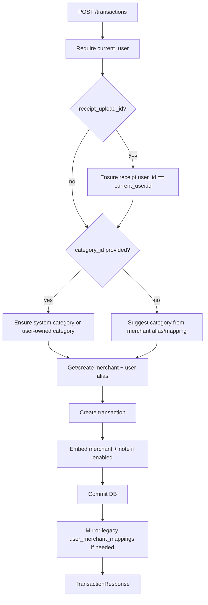

Current compatibility layer:

- `transactions.merchant_name` remains for old UI/report code.
- New writes also populate:
  - `transactions.raw_merchant_name`
  - `transactions.merchant_id`
  - `transactions.source`
  - `user_merchant_aliases`

## 7. Merchant Normalization

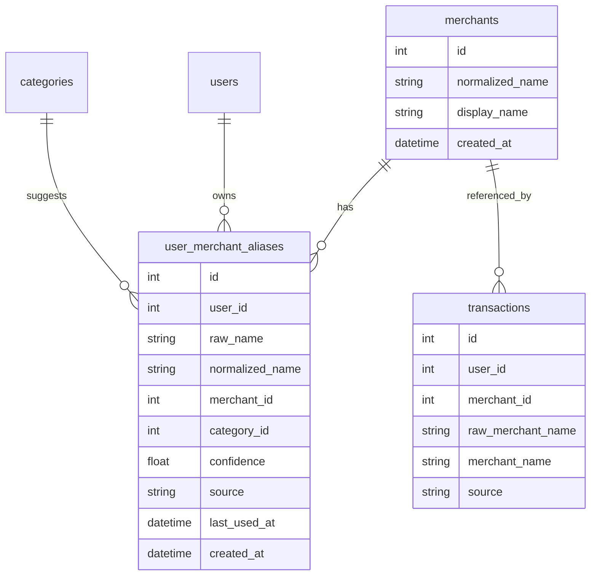

Intent:

- `merchants` is global normalized identity.
- `user_merchant_aliases` is user-specific raw naming and category learning.
- `user_merchant_mappings` remains temporarily for backward compatibility.

Example:

```text
Raw names:
  Highland Coffee Q1
  HIGHLANDS COFFEE
  Highland Coffee Nguyen Hue

May point to:
  merchants.normalized_name = highland coffee
```

## 8. Receipts API

Endpoints:

```text
POST /api/v1/receipts/upload
GET  /api/v1/receipts/{receipt_id}
GET  /api/v1/receipts/{receipt_id}/ocr-result
GET  /api/v1/receipts/{receipt_id}/draft
GET  /api/v1/receipts/{receipt_id}/invoice
```

### Upload Flow

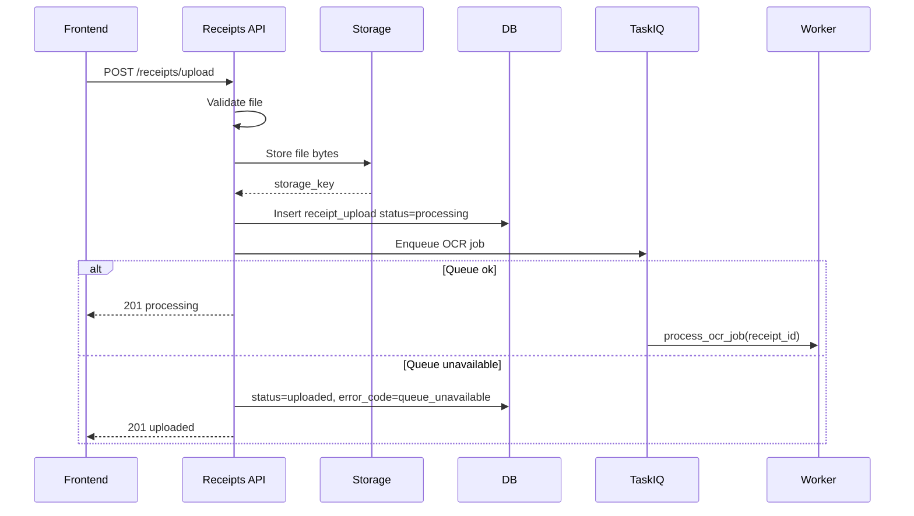

### OCR Processing Flow

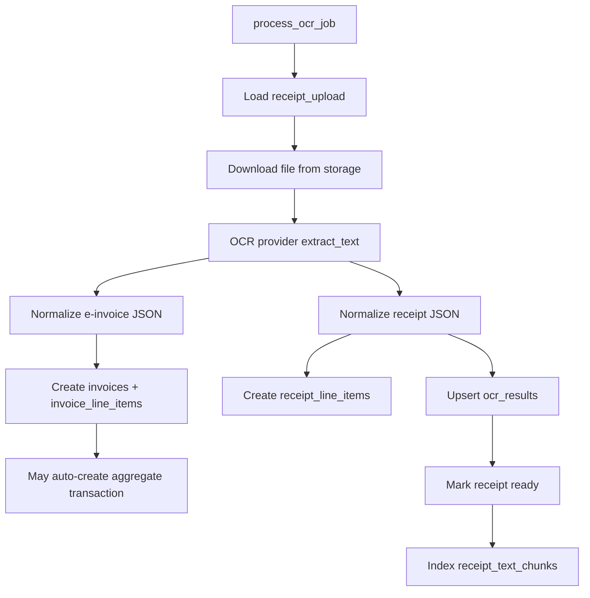

Boundary:

- `receipt_uploads` manages file and pipeline state.
- `ocr_results` stores raw and normalized OCR payload for review/debug.
- `transactions` remains the reporting source of truth.

## 9. Receipt vs E-invoice

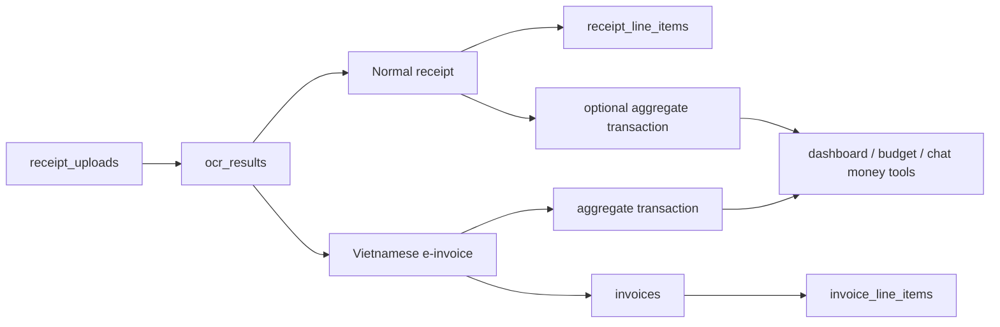

Current rule:

```text
receipt thường -> receipt_line_items
e-invoice      -> invoices + invoice_line_items
báo cáo tiền   -> transactions
```

Open design question:

- Should normal receipts also auto-create aggregate transactions, or only after user review?
- Should line items ever become item-level transactions, or stay as detail rows?

## 10. Categories API

Current model:

```text
categories.user_id nullable
categories.is_system boolean
```

Interpretation:

```text
user_id = null / is_system = true  -> system category
user_id = current_user.id          -> user category
```

Access rule:

```text
category.user_id == current_user.id
OR category.is_system == true
```

Planned improvement:

```text
scope enum('system', 'user')
parent_id nullable
unique(user_id, name)
unique(name) where user_id is null
```

## 11. Budgets API

Budget shape:

```text
budgets
  user_id
  category_id
  period_month
  amount
```

Constraint:

```text
unique(user_id, category_id, period_month)
```

Usage calculation:

```sql
sum(transactions.amount)
where transactions.user_id = budgets.user_id
and transactions.category_id = budgets.category_id
and transaction_date is inside budget month
```

Boundary:

- Budget usage reads only from `transactions`.
- OCR and chat do not directly affect budget except through created transactions.

## 12. Dashboard API

Dashboard reads transaction aggregates.

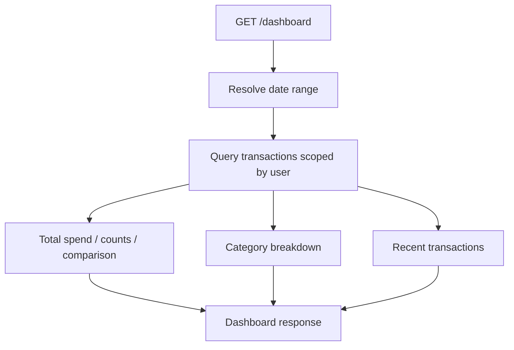

Correct boundary:

- Dashboard should not read `ocr_results.normalized_payload`.
- Dashboard should not read `chat_messages`.

## 13. Chat API

Chat uses an orchestrator and tools.

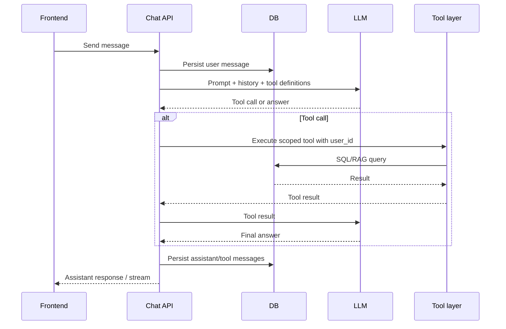

Tool routing rules:

```text
Money totals / trends / budgets -> SQL over transactions and budgets
Receipt contents                -> receipt_text_chunks / line_items
Fuzzy merchant/product memory   -> transaction embeddings + merchant aliases
```

## 14. RAG and Search

Current search structures:

- `receipt_text_chunks.embedding`: search OCR text content.
- `transactions.search_embedding`: search merchant/note meaning.
- `user_merchant_aliases`: deterministic merchant normalization and category learning.

Important rule:

```text
RAG can find relevant rows.
SQL transactions decide financial facts.
```

## 15. Ownership and Data Isolation

Current approach is mostly service-layer enforcement.

Examples already present:

- Transaction owner check by `transaction.user_id`.
- Receipt owner check by `receipt.user_id`.
- Category access check by system/user ownership.

High-risk relationships that must stay guarded:

```text
transactions.category_id
transactions.receipt_upload_id
budgets.category_id
receipt_line_items.category_id
receipt_text_chunks.receipt_upload_id
invoices.receipt_upload_id
invoice_line_items.invoice_id
user_merchant_aliases.category_id
```

Future hardening options:

1. Centralize service-layer ownership helpers.
2. Add PostgreSQL triggers for cross-user validation.
3. Add composite keys where practical.

## 16. Current Strengths

- Routes are grouped by domain.
- Financial source of truth is mostly clear: `transactions`.
- OCR is asynchronous through worker.
- Storage is abstracted.
- Chat does not directly own financial data.
- Merchant normalization now has a forward-compatible schema.
- Test coverage catches API and worker regressions.

## 17. Current Weaknesses

### Router logic is too heavy

`transactions.py` currently handles validation, merchant normalization, category suggestion, embedding, DB writes, and response enrichment.

Refactor target:

```text
TransactionRouter -> TransactionService -> repositories/helpers
```

### Repository layer is thin/missing

Many SQL queries live inside routers/services. As ownership logic grows, this will get harder to audit.

### Receipt/invoice processing is worker-heavy

`worker/tasks.py` contains several domain decisions. It should eventually delegate to explicit domain services.

### ERD drift

`docs/erd.puml` is outdated. The real source is `pfa_shared.entities`.

### Ownership is not DB-enforced yet

Service checks exist, but database constraints/triggers are not comprehensive.

## 18. Suggested Refactor Order

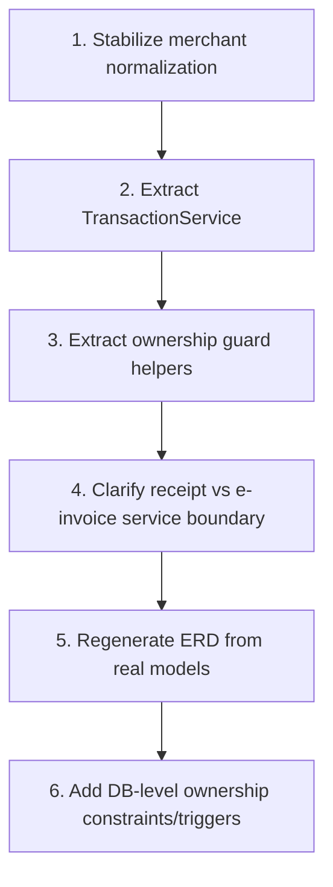

Recommended next code step:

```text
Create TransactionService with:
  create_transaction
  update_transaction
  delete_transaction
  list_transactions
  ensure_transaction_owner
  ensure_category_accessible
  ensure_receipt_owner
```

This would reduce router complexity and make ownership rules easier to test.

