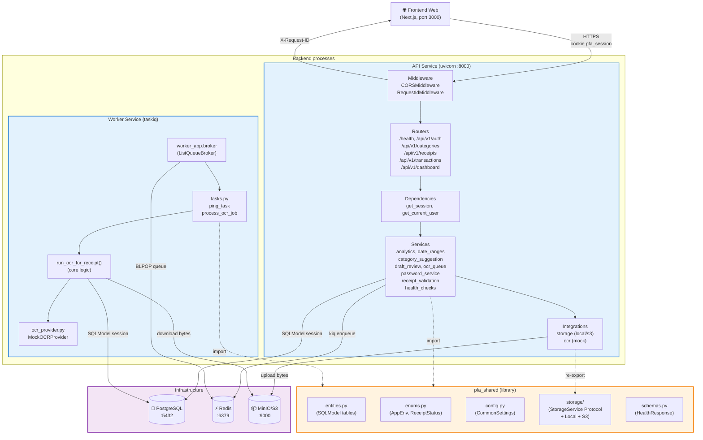
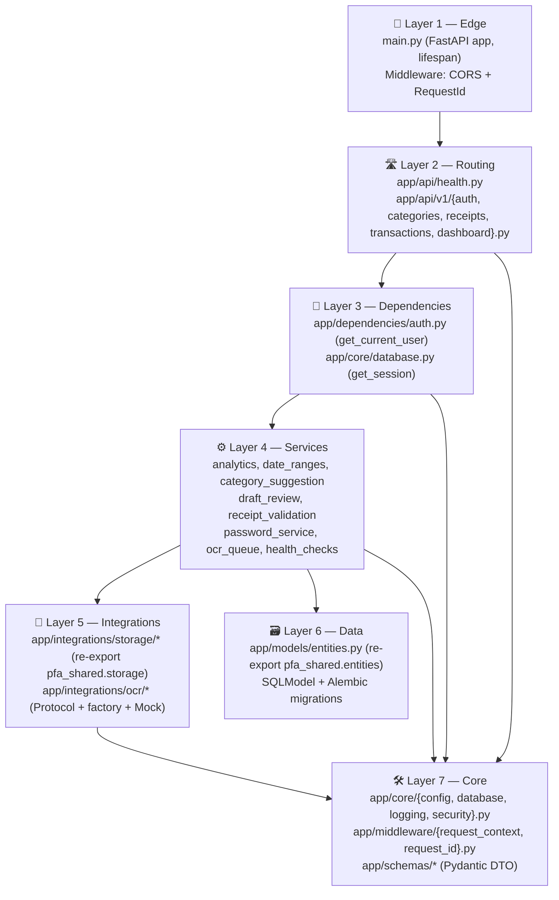
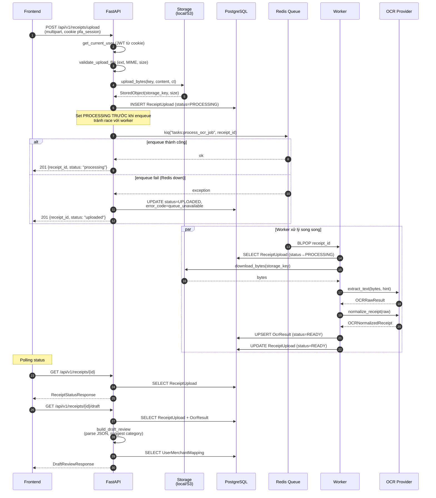
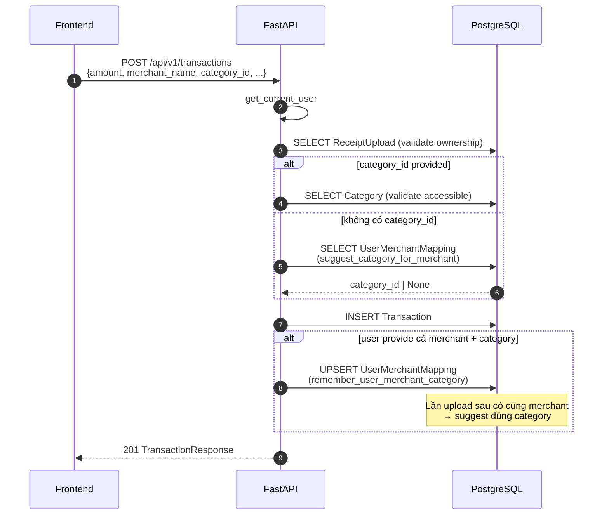
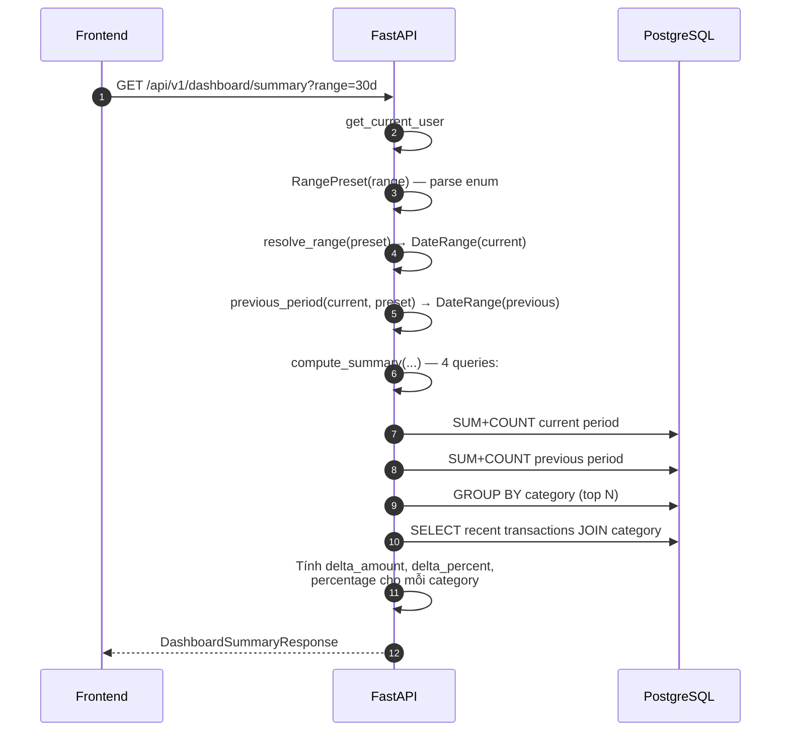
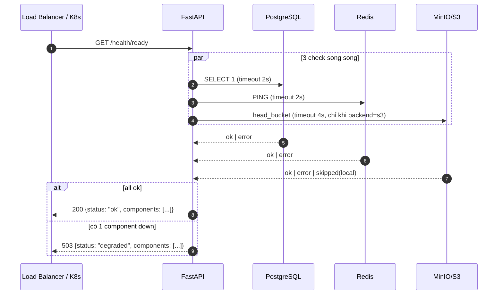
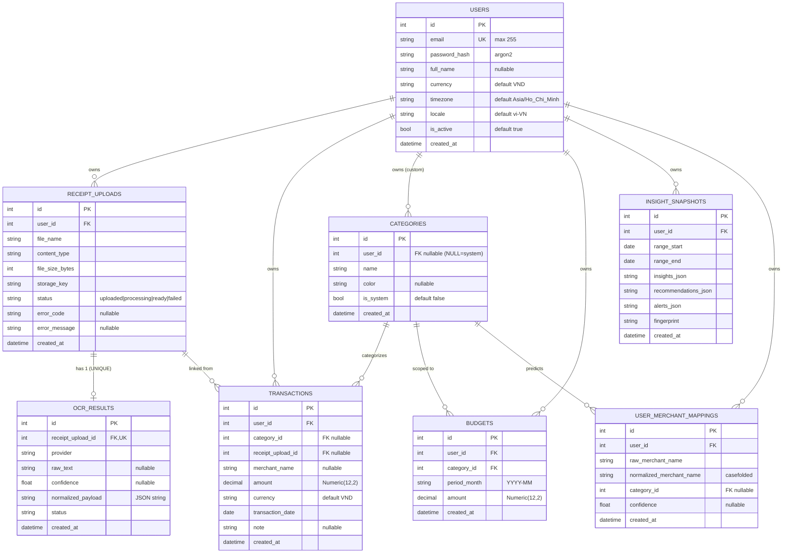

# 1. Tổng quan + Sơ đồ kiến trúc

## 1.1 Tổng quan hệ thống

Backend gồm **3 Python package** chia sẻ qua `uv` workspace:

| Package | Đường dẫn | Vai trò | Process |
|---|---|---|---|
| **API** | `backend/api/` | FastAPI HTTP service — auth, CRUD transaction, OCR upload, dashboard | `uvicorn app.main:app` |
| **Worker** | `backend/worker/` | TaskIQ consumer — chạy OCR job bất đồng bộ | `taskiq worker worker_app:broker` |
| **Shared** | `backend/shared/` | Library `pfa_shared` — entities, enums, config, storage adapter dùng chung | (library) |

**Hạ tầng phụ thuộc**: PostgreSQL (data), Redis (TaskIQ queue + result backend), MinIO/S3 (lưu ảnh hóa đơn). Mọi config tải từ environment variables.

**Điểm thiết kế chính**:
- API và Worker tách process riêng, giao tiếp **chỉ qua Redis queue** (TaskIQ) + **DB** (cùng schema). Không có RPC trực tiếp.
- `pfa_shared` là **single source of truth** cho entity và storage adapter (M5 refactor) — tránh drift schema giữa 2 service.
- API `lifespan` quản lý vòng đời broker; nếu Redis down thì app vẫn boot, endpoint upload **fail-soft** sang trạng thái `UPLOADED + error_code=queue_unavailable`.
- Storage adapter `local | s3` chọn theo env `STORAGE_BACKEND` — staging/prod **bắt buộc** `s3` (validate trong `Settings._enforce_production_secrets`).

## 1.2 Sơ đồ kiến trúc tổng thể

## 1.3 Layered architecture trong API service

## 1.4 Sơ đồ luồng dữ liệu — Upload hóa đơn → OCR → Review draft

## 1.5 Sơ đồ luồng — Tạo transaction + học mapping merchant

## 1.6 Sơ đồ luồng — Dashboard summary

## 1.7 Sơ đồ luồng — Readiness check (`/health/ready`)

## 1.8 Mô hình dữ liệu (ERD)

**Constraint nổi bật**:
- `users.email` `UNIQUE` index → register check duplicate.
- `ocr_results.receipt_upload_id` `UNIQUE` → mỗi receipt có nhiều nhất 1 OCR result; worker dùng UPSERT để retry idempotent.
- `categories.user_id NULL + is_system=True` → system seed; user-defined có `user_id != NULL + is_system=False`.
- `transactions.amount Numeric(12,2)` → tránh float precision; max 999_999_999.99.
