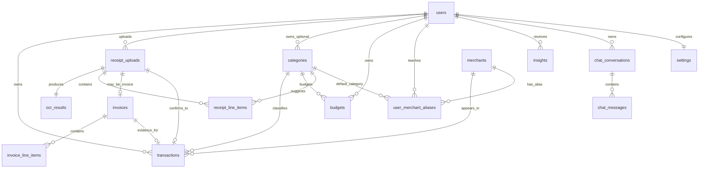
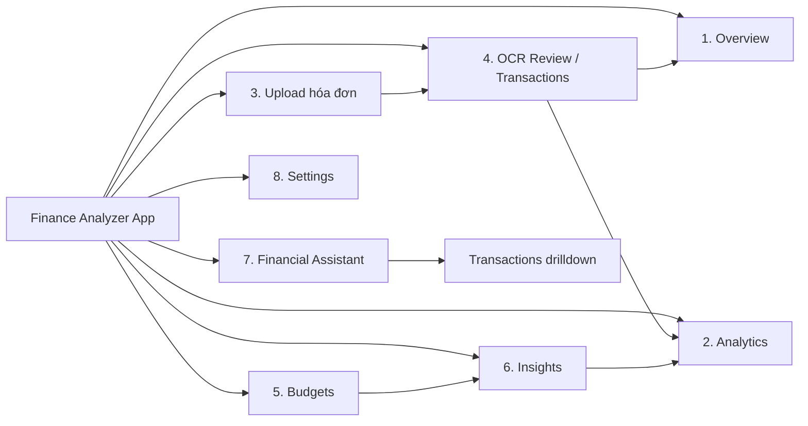
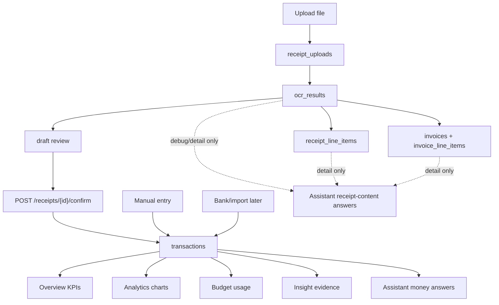
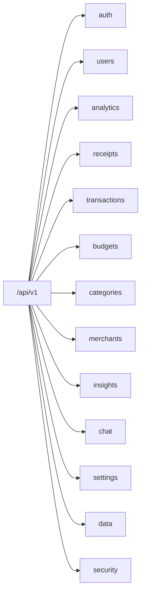

# Personal Finance Analyzer — Major Redesign Plan

> Mục tiêu: chốt domain, chuẩn hóa API theo 8 màn UI, thiết kế database chi tiết, và kiểm tra chéo UI ↔ API ↔ DB để chuẩn bị cho một đợt refactor lớn nhưng kiểm soát được.

## 0. Executive Summary

Thiết kế hiện tại đã có nền tốt: 8 màn UI trong `finance-analyzer-ui` đã thể hiện đúng hướng sản phẩm SaaS analytics cá nhân, backend đã có các domain chính như auth, receipts, transactions, budgets, dashboard, chat, categories; schema thật đã có receipt/OCR/invoice/RAG/merchant ở mức khá gần mục tiêu.

Điểm cần chuẩn hóa lớn nhất là tách rõ 4 lớp:

```text
UI state / UX interaction
→ API contract
→ domain service logic
→ database source-of-truth
```

Quyết định nền:

```text
transactions = financial source of truth sau khi user xác nhận
receipt_uploads / ocr_results / line_items / invoices = document source, input, review, evidence, detail
budgets = target/limit, usage tính từ transactions
insights = generated evidence-backed narrative, không tự là nguồn số liệu
chat = conversation + tool orchestration, không tự là nguồn số liệu
settings = user preferences ảnh hưởng cách query/render
```

## 1. Step 1 — Chốt Entity Chính

### 1.1 Entity List Chính Thức

| Entity | Vai trò | Source-of-truth? | Ownership |
|---|---|---:|---|
| `User` | Gốc ownership, auth profile | Có cho identity | Owns all user data |
| `Transaction` | Giao dịch tài chính chính thức, tạo từ manual/import hoặc receipt confirm | Có, có `status` | `user_id` bắt buộc |
| `ReceiptUpload` | File hóa đơn, pipeline state, ngày upload/ngày hóa đơn/tổng OCR để truy xuất chứng từ | Không cho số tiền chính thức | `user_id` bắt buộc |
| `OcrResult` | Raw text + normalized OCR payload | Không | Qua `receipt_upload_id` |
| `ReceiptLineItem` | Dòng hàng hóa đơn thường | Không | Qua `receipt_upload_id`, nên thêm `user_id` |
| `Invoice` | E-invoice Việt Nam | Không cho dashboard, có cho invoice detail | `user_id` bắt buộc |
| `InvoiceLineItem` | Dòng hàng e-invoice | Không | Qua `invoice_id`, nên có trace user qua invoice |
| `Category` | Taxonomy chi tiêu system/user | Reference truth | `user_id nullable` |
| `Budget` | Hạn mức theo category/tháng | Có cho target | `user_id` bắt buộc |
| `Merchant` | Merchant normalized toàn cục | Reference truth | Global |
| `UserMerchantAlias` | Raw merchant alias theo user | Learning/cache có kiểm soát | `user_id` bắt buộc |
| `Insight` | Insight có evidence/action | Không cho số liệu gốc | `user_id` bắt buộc |
| `ChatConversation` | Thread chat | Không | `user_id` bắt buộc |
| `ChatMessage` | Message/tool result | Không | `user_id` + `conversation_id` |
| `Settings` | User preferences | Có cho config | `user_id` unique |

### 1.2 Entity Quan Hệ Tổng Quan



### 1.3 Chênh Lệch Hiện Tại Cần Sửa

| Mục tiêu | Hiện tại | Việc cần làm |
|---|---|---|
| `Insight` entity | Đang là `InsightSnapshot` JSON blob | Tách `insights` row-level hoặc giữ snapshot làm cache, thêm entity `Insight` chính thức |
| `ChatConversation` | Chưa có, `chat_messages` gắn trực tiếp user | Thêm conversation để hỗ trợ drawer/history/delete thread |
| `Settings` | Một phần nằm trong `users`, UI mock có settings riêng | Thêm `settings` table hoặc tách `user_settings` theo domain |
| Receipt confirm | Backend hiện auto-create transaction từ invoice trong worker | Chuẩn hóa thành: OCR tạo document/draft; user confirm mới tạo hoặc cập nhật 1 transaction chính thức |
| API names | Backend có `/dashboard`, doc v4 muốn `/analytics/*` | Chuẩn hóa thành `/analytics/*`, giữ `/dashboard` alias tạm nếu cần |
| Transaction update method | Backend dùng `PUT`, doc v4 muốn `PATCH` | Chọn `PATCH` cho partial update, giữ `PUT` deprecated |

## 2. Step 2 — API Backend Mapping Theo 8 Màn

### 2.1 Navigation Map



### 2.2 UI Hiện Có — Điểm Mạnh

| Màn | Điểm mạnh |
|---|---|
| Overview | Có KPI grid, chart thu/chi, budget composition, recent transactions; đúng mental model dashboard |
| Analytics | Có phân tích category, weekday frequency, rule 50/30/20; tạo cảm giác analytics thật |
| Upload/OCR | Split view receipt preview + correction form rất đúng flow review |
| Transactions | Có filter/search/modal add; gần với CRUD screen |
| Budgets | Cards, progress, threshold alert dễ hiểu |
| Insights | Có filter type, regenerate, card severity; đúng hướng evidence/action feed |
| Assistant | Chat-first layout, prompt chips, typing state; có base tốt |
| Settings | Đã có profile, currency, budget threshold, OCR engine; đủ khởi đầu |

### 2.3 UI Hiện Có — Điểm Yếu Và Rủi Ro Logic

| Vấn đề | Ví dụ hiện tại | Tác động | Hướng sửa |
|---|---|---|---|
| Client tự tính business truth | `App.tsx` update `budgets.spent` khi thêm/xóa transaction | Dễ lệch dashboard/budget | Backend tính usage từ `transactions` |
| OCR sync tạo transaction trực tiếp ở client | `handleSyncOCRReceiptToTransactions` | Không enforce ownership, duplicate, audit yếu | Backend confirm endpoint tạo transaction chính thức; UI chỉ review/sửa rồi confirm |
| API proxy lệch contract | `/api/chat`, `/api/ocr`, `/api/insights` | Sau này khó đổi sang backend thật | Tạo `src/lib/api/*` theo `/api/v1/*` |
| Mock field lệch domain | `description`, `date`, `category`, `spent` | Mapping rối | Đổi sang `merchant`, `transaction_date`, `category_id/name`, `spent_amount` |
| Insight thiếu evidence structured | `description`, `impactValue` string | Chat/insight dễ bịa số | Response có `evidence[]`, `actions[]`, `source_type` |
| Chat chưa có conversation | one global `chatHistory` | Không có drawer/thread | Thêm `/chat/conversations` |
| Settings thiếu privacy/security/data | chỉ profile/currency/OCR | SaaS chưa đủ tin cậy | Bổ sung sections: security, privacy, export, retention |
| Landing SaaS chưa rõ trong app shell | yêu cầu có hero/pricing/trust nhưng UI hiện là logged-in app | Cần phân biệt public landing và authenticated dashboard | Thiết kế landing riêng hoặc mode marketing trước login |
| Thiếu màn danh sách hóa đơn | UI có Upload/OCR Review nhưng chưa có Receipt Retrieval | User khó tìm lại chứng từ đã upload | Thêm Receipt List screen hoặc tab con trong Upload/OCR |

### 2.4 UI UX Pro Max — Hướng Nâng Cấp

#### Landing Page SaaS Analytics

Nếu `finance-analyzer-ui` cần thêm landing page trước app, không nên biến dashboard thành landing. Nên có public route riêng:

```text
/                 = SaaS landing page
/app/overview     = authenticated product
```

Landing page đề xuất:

| Section | Nội dung cần có | API liên quan |
|---|---|---|
| Hero | Product name, value prop, CTA dùng thử, real dashboard preview | Public/static |
| Dashboard Preview | Ảnh/app mockup có KPI thật, OCR pipeline, assistant answer | Static/demo data |
| Feature Highlights | Receipt OCR, analytics, budgets, AI assistant, privacy | Static |
| Trust Badges | Local-first/env-safe, no client API key, encrypted auth cookie, export/delete data | Static/public |
| Pricing Table | Free/Pro/Team hoặc MVP placeholder | `/billing/plan` sau login hoặc public config |
| Final CTA | Upload hóa đơn đầu tiên / tạo tài khoản | `/auth/register` |

Visual rules:

```text
Hero: H1 = Personal Finance Analyzer hoặc Ví Thông Minh
CTA chính: Bắt đầu phân tích chi tiêu
CTA phụ: Xem demo OCR
Preview phải cho thấy sản phẩm thật, không chỉ gradient/card trang trí
Spacing: max-width 1120-1200px, section padding 80px desktop / 48px mobile
Typography: H1 48-64 desktop, 34-40 mobile; app UI headings 14-24, không hero-scale trong cards
```

#### Authenticated App Shell

Giữ tinh thần hiện tại: nền trắng, emerald accent, sidebar trái. Nâng cấp bằng cách:

| Area | Cải thiện cụ thể |
|---|---|
| Sidebar | Nhóm menu theo `Analyze`, `Manage`, `AI`, `Account`; thêm collapsed state cho tablet |
| Topbar | Global date range, currency, data freshness, notification center |
| Cards | Radius tối đa 8px nếu muốn enterprise SaaS hơn; giảm emoji, dùng lucide icons |
| Tables | Sticky header, density toggle, row actions menu, empty/loading/error states |
| Charts | Thêm skeleton/loading, tooltip nhất quán, drilldown click đến transactions |
| Responsive | Mobile dùng bottom nav hoặc drawer, table chuyển card list |
| Microcopy | Nói rõ “Dựa trên giao dịch đã xác nhận”; màn hóa đơn nói rõ “Chứng từ chưa lưu thành giao dịch” nếu chưa confirm |

### 2.5 API Mapping Theo Screen / Component

#### Shared Layer — Receipt Retrieval

Lớp này phục vụ nhu cầu xem lại chứng từ, không phục vụ tính tổng tiền chính thức.

| Component/use case | API | Method | Reads | Writes | Note |
|---|---|---|---|---|---|
| Receipt list/search | `/receipts` | GET | `receipt_uploads`, `ocr_results`, linked `transactions`, `invoices` | - | Filter theo merchant, receipt_date, created_date, status, has_transaction, has_invoice |
| Receipt detail | `/receipts/{id}` | GET | `receipt_uploads`, `ocr_results`, linked refs | - | Metadata + status + links |
| Receipt image | `/receipts/{id}/image` | GET | `receipt_uploads`, storage | - | Signed URL or streamed file |
| Receipt line items | `/receipts/{id}/line-items` | GET | `receipt_line_items` | - | Receipt thường |
| Receipt transaction link | `/receipts/{id}/transaction` | GET | `transactions` | - | 404 nếu chưa confirm |
| Transaction receipt link | `/transactions/{id}/receipt` | GET | `transactions`, `receipt_uploads` | - | Mở chứng từ từ transaction row |
| Receipt invoice | `/receipts/{id}/invoice` | GET | `invoices`, `invoice_line_items` | - | E-invoice detail |
| Invoice detail | `/invoices/{id}` | GET | `invoices` | - | Direct invoice lookup |
| Invoice line items | `/invoices/{id}/line-items` | GET | `invoice_line_items` | - | VAT/detail rows |

Các loại ngày phải tách rõ:

| Field | Nằm ở bảng | Ý nghĩa | Dùng khi user hỏi |
|---|---|---|---|
| `created_at` | `receipt_uploads` | Ngày user upload chứng từ | “hóa đơn tôi upload hôm qua” |
| `receipt_date` | `receipt_uploads` hoặc normalized OCR | Ngày ghi trên hóa đơn | “hóa đơn ngày hôm qua” |
| `transaction_date` | `transactions` | Ngày giao dịch chính thức | “hôm qua tôi tiêu bao nhiêu” |
| `confirmed_at` | `transactions` | Ngày user xác nhận receipt thành transaction | audit/review |

#### Screen 1 — Overview

| Component | API | Method | Reads | Writes | Note |
|---|---|---|---|---|---|
| Global range selector | `/settings/finance`, local state | GET | `settings` | - | Default range/timezone |
| KPI cards | `/analytics/overview` | GET | `transactions`, `budgets` | - | Không đọc OCR |
| Cashflow chart | `/analytics/trends` | GET | `transactions` | - | group_by day/week/month |
| Category composition | `/analytics/categories` | GET | `transactions`, `categories` | - | Percent từ confirmed transactions |
| Budget health | `/analytics/budgets` | GET | `budgets`, `transactions` | - | Usage computed |
| Hero insight | `/analytics/insight-feed` | GET | `insights`, `transactions` | - | Evidence structured |
| Merchant habits | `/analytics/merchants` | GET | `transactions`, `merchants` | - | Normalized merchant |
| Recent transactions | `/transactions` | GET | `transactions`, `categories`, `merchants` | - | limit=5 |
| Add transaction CTA | `/transactions` | POST | - | `transactions`, `user_merchant_aliases` | Modal/action |

#### Screen 2 — Analytics

| Component | API | Method | Reads | Writes | Note |
|---|---|---|---|---|---|
| Filters | `/categories`, `/analytics/merchants` | GET | `categories`, `transactions`, `merchants` | - | Shared filter options |
| Detailed trend | `/analytics/trends` | GET | `transactions` | - | compare supported |
| Ranked categories | `/analytics/categories` | GET | `transactions`, `categories` | - | Drilldown capable |
| Category detail | `/analytics/categories/{id}` | GET | `transactions`, `categories` | - | Include top merchants |
| Merchant table | `/analytics/merchants` | GET | `transactions`, `merchants`, `aliases` | - | Frequency/amount |
| Calendar heatmap | `/analytics/calendar` | GET | `transactions` | - | intensity/anomaly |
| Anomaly cards | `/analytics/anomalies` | GET | `transactions` | optionally `insights` | Can cache insight |
| Drilldown tx | `/transactions` | GET | `transactions` | - | query category/date |

#### Screen 3 — Upload Hóa Đơn

| Component | API | Method | Reads | Writes | Note |
|---|---|---|---|---|---|
| Dropzone | `/receipts` | POST | - | `receipt_uploads`, file storage, OCR job | OCR tạo chứng từ/draft, chưa tạo transaction chính thức |
| Processing timeline | `/receipts/{id}` | GET | `receipt_uploads`, `ocr_results` | - | Polling/SSE later |
| Recent uploads | `/receipts` | GET | `receipt_uploads` | - | status list |
| Retry OCR | `/receipts/{id}/retry` | POST | `receipt_uploads` | `ocr_results`, job state | Guard owner |
| Review CTA | `/receipts/{id}/draft` | GET | `ocr_results`, line items, invoice, linked transaction if any | - | Navigate review draft |

#### Screen 4 — OCR Review / Transactions

| Component | API | Method | Reads | Writes | Note |
|---|---|---|---|---|---|
| Receipt preview | `/receipts/{id}` | GET | `receipt_uploads` | - | Signed file preview if needed |
| OCR raw/debug | `/receipts/{id}/ocr-result` | GET | `ocr_results` | - | Hidden/advanced panel |
| Draft/review form | `/receipts/{id}/draft` | GET | `ocr_results`, line items, invoice, aliases, linked transaction if any | - | Shows draft candidate before official transaction |
| Save review edits | `/receipts/{id}/draft` | PATCH | receipt owner | `ocr_results`, line item categories, draft payload | Optional saved draft |
| Confirm review | `/receipts/{id}/confirm` | POST | draft data, categories, merchant | `transactions`, aliases, receipt status | Creates official tx once; subsequent calls update/link safely |
| Tx table | `/transactions` | GET | `transactions`, categories, merchants, invoice flag | - | Search/filter/page |
| Add tx | `/transactions` | POST | categories/merchant aliases | `transactions`, aliases | Manual source |
| Edit tx | `/transactions/{id}` | PATCH | transaction | `transactions`, aliases | Partial update |
| Delete tx | `/transactions/{id}` | DELETE | transaction | soft delete preferred | Preserve audit |

#### Screen 5 — Budgets

| Component | API | Method | Reads | Writes | Note |
|---|---|---|---|---|---|
| Summary meter | `/analytics/budgets` | GET | `budgets`, `transactions` | - | Usage from tx |
| Budget cards/list | `/budgets` | GET | `budgets`, categories | - | Targets only |
| Create budget | `/budgets` | POST | category access | `budgets` | unique month/category |
| Update budget | `/budgets/{id}` | PATCH | budget owner | `budgets` | amount/currency |
| Delete budget | `/budgets/{id}` | DELETE | budget owner | soft delete or delete | No tx effect |
| Recommendations | `/analytics/insight-feed` | GET | insights/evidence | - | Budget warning |

#### Screen 6 — Insights

| Component | API | Method | Reads | Writes | Note |
|---|---|---|---|---|---|
| Hero insight | `/analytics/insight-feed` | GET | `insights`, `transactions`, `budgets` | - | Latest/highest severity |
| Insight grid | `/analytics/insight-feed` | GET | `insights` | - | Card list |
| Insight timeline | `/insights` | GET | `insights` | - | Historical |
| Insight detail | `/insights/{id}` | GET | `insights`, evidence source rows | - | Explainable |
| Generate | `/insights/generate` | POST | `transactions`, `budgets`, settings | `insights` | Async later |
| Dismiss | `/insights/{id}` | PATCH | insight owner | `insights.dismissed_at` | Not delete |
| Feedback | `/insights/{id}/feedback` | POST | insight | feedback/audit | Train quality |

#### Screen 7 — Financial Assistant

| Component | API | Method | Reads | Writes | Note |
|---|---|---|---|---|---|
| Conversation drawer | `/chat/conversations` | GET | `chat_conversations` | - | paginated |
| New conversation | `/chat/conversations` | POST | - | `chat_conversations` | title optional |
| Thread messages | `/chat/conversations/{id}/messages` | GET | `chat_messages` | - | scoped owner |
| Send message | `/chat/messages` | POST | settings, tx/tools as needed | `chat_messages` | evidence/actions |
| Stream/result | `/chat/messages/{id}/result` | GET | chat/job state | assistant message | if async |
| Feedback | `/chat/messages/{id}/feedback` | POST | message owner | feedback | quality |
| Regenerate | `/chat/messages/{id}/regenerate` | POST | prior context | new assistant msg | preserve history |
| Related tx | `/transactions` | GET | transactions | - | on demand |
| Related insights | `/analytics/insight-feed` | GET | insights | - | on demand |

#### Screen 8 — Settings

| Component | API | Method | Reads | Writes | Note |
|---|---|---|---|---|---|
| Profile | `/users/me` or `/auth/me` | GET/PATCH | `users` | `users` | normalize naming |
| Finance settings | `/settings/finance` | GET/PATCH | `settings`, `users` | `settings` | currency/timezone/range |
| Notifications | `/settings/notifications` | GET/PATCH | `settings` | `settings` | email/push |
| AI/OCR settings | `/settings/ai` | GET/PATCH | `settings` | `settings` | provider choices, privacy flag |
| Privacy/data | `/settings/privacy` | GET/PATCH | `settings` | `settings` | retention |
| Security sessions | `/security/sessions` | GET/DELETE | sessions | sessions | later |
| Export data | `/data/export` | POST | all user-owned tables | export job | retention |
| Delete receipt files | `/data/receipt-files` | DELETE | receipt_uploads | storage + status | keep tx metadata |
| Billing usage | `/billing/usage` | GET | usage tables/logs | - | future |

## 3. Step 3 — Thiết Kế Database Chi Tiết

### 3.1 Table Design Matrix

| Table | Key fields | Type notes | Index | FK | Unique | Ownership rule | Soft delete | Retention rule |
|---|---|---|---|---|---|---|---|---|
| `users` | `id`, `email`, `password_hash`, `full_name`, `currency`, `timezone`, `locale`, `is_active`, `created_at`, `deleted_at` | email varchar 255 | `email` | - | `email` | self | `deleted_at` recommended | Account delete anonymize or purge by policy |
| `settings` | `id`, `user_id`, `finance_json`, `notification_json`, `privacy_json`, `ai_json`, `created_at`, `updated_at` | JSONB preferred | `user_id` | `users.id` | `user_id` | row user owns | no, delete with user | Privacy retention config source |
| `categories` | `id`, `user_id`, `name`, `parent_id`, `scope`, `color`, `icon`, `created_at`, `deleted_at` | `scope system/user` | `(user_id,name)`, `scope` | `users.id`, self parent | partial `name where user_id null`; `(user_id,name)` | system or same user | yes for user cats | Keep if referenced, hide deleted |
| `merchants` | `id`, `normalized_name`, `display_name`, `created_at` | global | `normalized_name` | - | `normalized_name` | global reference | no usually | Keep global |
| `user_merchant_aliases` | `id`, `user_id`, `raw_name`, `normalized_name`, `merchant_id`, `category_id`, `confidence`, `source`, `last_used_at`, `created_at`, `deleted_at` | source enum | `(user_id,raw_name)`, `merchant_id` | users, merchants, categories | `(user_id,raw_name)` | `user_id` and category accessible | yes | Purge with user/account delete |
| `transactions` | `id`, `user_id`, `merchant_id`, `raw_merchant_name`, `category_id`, `receipt_upload_id`, `amount`, `currency`, `transaction_date`, `note`, `source`, `status`, `confirmed_at`, `search_embedding`, `created_at`, `updated_at`, `deleted_at` | amount numeric 15,2; `source manual/ocr/invoice/import`; `status confirmed/corrected/deleted` | `(user_id,transaction_date)`, `(user_id,category_id,transaction_date)`, `(user_id,merchant_id)`, `(receipt_upload_id)`, vector index | users, merchants, categories, receipts | partial unique `(user_id, receipt_upload_id) where receipt_upload_id is not null and deleted_at is null` | all FK must be same user or global | yes | Keep metadata until user purge/export policy |
| `receipt_uploads` | `id`, `user_id`, `storage_key`, `original_filename`, `mime_type`, `file_size_bytes`, `merchant_name`, `receipt_date`, `total_amount`, `currency`, `status`, `ocr_status`, `has_invoice`, `error_code`, `error_message`, `created_at`, `updated_at`, `deleted_at` | status enum; cached OCR summary for list/search | `(user_id,created_at)`, `(user_id,receipt_date)`, `(user_id,status)`, `(user_id,merchant_name)` | users | `storage_key` | `user_id` | yes | Delete file after `receipt_file_retention_days`; keep row if tx exists |
| `ocr_results` | `id`, `receipt_upload_id`, `provider`, `status`, `raw_text`, `normalized_json`, `confidence`, `created_at`, `deleted_at` | JSONB for normalized | `receipt_upload_id` | receipts | `receipt_upload_id` | via receipt owner | yes/cascade | Raw text can purge per privacy retention |
| `receipt_line_items` | `id`, `user_id`, `receipt_upload_id`, `transaction_id`, `raw_name`, `normalized_name`, `quantity`, `unit_price`, `amount`, `category_id`, `confidence`, `created_at`, `deleted_at` | numeric 15,2 | `(user_id,receipt_upload_id)`, `(user_id,category_id)` | users, receipts, transactions, categories | optional `(receipt_upload_id,line_number)` | `user_id == receipt.user_id`; tx same user | yes/cascade | Purge with receipt if requested |
| `invoices` | `id`, `user_id`, `receipt_upload_id`, `transaction_id`, `seller_name`, `seller_tax_code`, `buyer_name`, `buyer_tax_code`, `invoice_number`, `invoice_date`, `subtotal`, `vat_amount`, `total_amount`, `currency`, `lookup_code`, `signed_status`, `created_at`, `deleted_at` | numeric 15,2 | `(user_id,invoice_date)`, `(seller_tax_code)`, `(invoice_number)` | users, receipts, transactions | `receipt_upload_id`; maybe `(seller_tax_code,invoice_number,invoice_date,user_id)` | user + receipt + tx same user | yes | Keep tax metadata until purge; files separate |
| `invoice_line_items` | `id`, `invoice_id`, `line_number`, `name`, `unit`, `quantity`, `unit_price`, `subtotal`, `vat_rate`, `vat_amount`, `total_amount`, `created_at`, `deleted_at` | numeric 15,2 | `invoice_id` | invoices | `(invoice_id,line_number)` | via invoice user | yes/cascade | Purge with invoice |
| `budgets` | `id`, `user_id`, `category_id`, `period_month`, `amount`, `currency`, `created_at`, `updated_at`, `deleted_at` | period `YYYY-MM` | `(user_id,period_month)`, `(user_id,category_id,period_month)` | users, categories | `(user_id,category_id,period_month)` | category system or same user | yes | Keep historical budgets unless user purge |
| `insights` | `id`, `user_id`, `type`, `severity`, `title`, `summary`, `evidence_json`, `actions_json`, `range_start`, `range_end`, `status`, `dismissed_at`, `created_at`, `expires_at`, `deleted_at` | JSONB evidence/actions | `(user_id,created_at)`, `(user_id,type,status)` | users | optional fingerprint unique per user | `user_id` | yes/dismiss | Expire/cache purge after 90-180d configurable |
| `chat_conversations` | `id`, `user_id`, `title`, `created_at`, `updated_at`, `archived_at`, `deleted_at` | - | `(user_id,updated_at)` | users | - | `user_id` | yes | Purge per chat retention/privacy |
| `chat_messages` | `id`, `conversation_id`, `user_id`, `role`, `content`, `tool_name`, `tool_call_id`, `tool_calls_json`, `evidence_json`, `created_at`, `deleted_at` | role enum; JSONB | `(conversation_id,created_at)`, `(user_id,created_at)` | users, conversations | maybe `tool_call_id` nullable | `user_id == conversation.user_id` | yes | Raw prompt retention configurable |

### 3.2 Source-of-truth Flow



### 3.3 DB Hardening Rules

Service layer bắt buộc từ Phase 1; DB trigger/composite hardening từ Phase 3.

```text
transactions.category_id:
  category.user_id is null OR category.user_id = transaction.user_id

budgets.category_id:
  category.user_id is null OR category.user_id = budget.user_id

transactions.receipt_upload_id:
  receipt_upload.user_id = transaction.user_id

receipt_line_items.receipt_upload_id:
  receipt_upload.user_id = receipt_line_items.user_id

invoices.receipt_upload_id:
  receipt_upload.user_id = invoices.user_id

invoices.transaction_id:
  transaction.user_id = invoices.user_id

chat_messages.conversation_id:
  chat_conversations.user_id = chat_messages.user_id
```

## 4. Step 4 — Kiểm Tra Chéo UI ↔ API ↔ DB

### 4.1 Cross-check Matrix Chính

| UI component/group | API | Tables read | Tables write | Source-of-truth OK? | Notes |
|---|---|---|---|---:|---|
| Overview KPI | `/analytics/overview` | `transactions`, `budgets` | - | Yes | Không dùng `budgets.spent` cached |
| Overview budget cards | `/analytics/budgets` | `budgets`, `transactions` | - | Yes | `spent_amount` computed |
| Overview recent tx | `/transactions` | `transactions`, `categories`, `merchants` | - | Yes | Query scoped user |
| Analytics category chart | `/analytics/categories` | `transactions`, `categories` | - | Yes | Confirmed transactions only |
| Analytics weekday/heatmap | `/analytics/calendar` | `transactions` | - | Yes | Timezone from settings |
| Receipt list/search | `/receipts` | `receipt_uploads`, `ocr_results`, linked `transactions`, `invoices` | - | Yes | Document retrieval, not money reporting |
| Upload dropzone | `/receipts` | - | `receipt_uploads`, storage, OCR job | Yes | Creates document/draft only |
| OCR review draft | `/receipts/{id}/draft` | `ocr_results`, `receipt_line_items`, `invoices`, aliases | - | Yes | Reviews document-derived draft |
| OCR confirm | `/receipts/{id}/confirm` | receipt draft, category, merchant | `transactions`, aliases, receipt status | Yes | Creates official transaction once |
| Open receipt from tx | `/transactions/{id}/receipt` | `transactions`, `receipt_uploads` | - | Yes | Evidence lookup |
| Transaction table | `/transactions` | `transactions` | - | Yes | Direct source |
| Transaction modal | `/transactions` | category/merchant refs | `transactions`, aliases | Yes | Manual source |
| Budget list | `/budgets` | `budgets`, `categories` | - | Yes | Target only |
| Budget usage | `/analytics/budgets` | `budgets`, `transactions` | - | Yes | No direct OCR |
| Insight feed | `/analytics/insight-feed` | `insights`, `transactions`, `budgets` | - | Yes if evidence from tx | Cache narrative only |
| Generate insight | `/insights/generate` | `transactions`, `budgets`, settings | `insights` | Yes | Store evidence refs |
| Assistant money Q&A | `/chat/messages` | `transactions`, `budgets`, categories | `chat_messages` | Yes | Tool result evidence required |
| Assistant receipt lookup | `/chat/messages` tools | `receipt_uploads`, linked `transactions`, `invoices` | `chat_messages` | Yes | `search_receipts`; receipt evidence, not official spend |
| Assistant transaction receipt lookup | `/chat/messages` tools | `transactions`, `receipt_uploads` | `chat_messages` | Yes | `lookup_transaction_receipts`; answers whether tx has evidence |
| Assistant receipt content Q&A | `/chat/messages` tools | `receipt_text_chunks`, line items, invoices | `chat_messages` | Yes | Must label as receipt detail, not official spend |
| Settings finance | `/settings/finance` | `settings`, `users` | `settings`, `users` | Yes | Affects query/render |
| Data export | `/data/export` | all user-owned tables | export job | Yes | No cross-user data |

### 4.2 Vi Phạm Hiện Tại Cần Sửa Trước Khi Build Thật

| Vi phạm/rủi ro | File hiện tại | Vì sao sai | Fix target |
|---|---|---|---|
| Budget spent lưu trong UI state | `finance-analyzer-ui/src/App.tsx`, `BudgetView.tsx` | `spent` là aggregate, không nên là source | `Budget` chỉ target; usage từ `/analytics/budgets` |
| OCR confirm ở client | `App.tsx`, `ReceiptOCRView.tsx` | Bỏ qua API ownership/idempotency | Client gọi `POST /api/v1/receipts/{id}/confirm`; backend tạo transaction |
| API path local proxy | `ReceiptOCRView.tsx`, `InsightsView.tsx`, `AssistantChatView.tsx` | Lệch backend contract | `src/lib/api/{receipts,insights,chat}.ts` |
| Chat không evidence structured | `ChatMessage.text` only | Không kiểm chứng số liệu | Message response gồm metrics/evidence/actions |
| Settings OCR engine nói Gemini | `SettingsView.tsx` | Provider hiện tại đã OpenAI-compatible/env | Đổi copy thành provider-agnostic: Vision OCR provider |
| Emoji trong enterprise UI | nhiều view | Kém premium/dễ lệch tone | Thay bằng icon/status chips |
| `InsightSnapshot` blob | backend entity | Khó filter/dismiss/feedback từng insight | Thêm `insights` table row-level |

## 5. Backend API Design Mục Tiêu

### 5.1 Router Map



### 5.2 Endpoint Priority

Phase 1 core:

```text
GET    /api/v1/categories
GET    /api/v1/merchants/search
GET    /api/v1/transactions
POST   /api/v1/transactions
PATCH  /api/v1/transactions/{id}
DELETE /api/v1/transactions/{id}
GET    /api/v1/budgets
POST   /api/v1/budgets
PATCH  /api/v1/budgets/{id}
DELETE /api/v1/budgets/{id}
```

Phase 2 receipt/OCR:

```text
POST   /api/v1/receipts
GET    /api/v1/receipts
GET    /api/v1/receipts/{id}
GET    /api/v1/receipts/{id}/ocr-result
GET    /api/v1/receipts/{id}/draft
PATCH  /api/v1/receipts/{id}/draft
POST   /api/v1/receipts/{id}/confirm
POST   /api/v1/receipts/{id}/retry
```

Phase 3 analytics:

```text
GET /api/v1/analytics/overview
GET /api/v1/analytics/trends
GET /api/v1/analytics/categories
GET /api/v1/analytics/categories/{id}
GET /api/v1/analytics/merchants
GET /api/v1/analytics/budgets
GET /api/v1/analytics/calendar
GET /api/v1/analytics/anomalies
GET /api/v1/analytics/insight-feed
```

Phase 4 AI/settings:

```text
GET/POST /api/v1/insights...
GET/POST /api/v1/chat...
GET/PATCH /api/v1/settings/finance
GET/PATCH /api/v1/settings/notifications
GET/PATCH /api/v1/settings/privacy
GET/PATCH /api/v1/settings/ai
```

## 6. Implementation Plan

### Phase A — Documentation Lock

Acceptance criteria:

```text
- Entity list được chốt.
- API mapping theo 8 màn được duyệt.
- Source-of-truth rules được viết trong docs.
- UI mock fields có mapping sang API fields.
```

### Phase B — Frontend Contract Layer

Tasks:

```text
1. Tạo `finance-analyzer-ui/src/lib/api/*`.
2. Tạo typed DTO theo API v4/v5.
3. Đổi component gọi API client thay vì fetch trực tiếp.
4. Giữ mock adapter để UI vẫn chạy khi backend chưa đủ endpoint.
5. Đổi `Budget.spent` thành API aggregate field, không tự mutate.
```

Acceptance criteria:

```text
- UI không gọi `/api/chat`, `/api/ocr`, `/api/insights` trực tiếp.
- Có mock adapter và real adapter cùng interface.
- OCR không tạo transaction ở client; backend confirm endpoint tạo transaction đúng ownership/idempotency.
```

### Phase C — Backend Domain Services

Tasks:

```text
1. Extract `TransactionService`.
2. Extract `ReceiptReviewService`.
3. Extract `AnalyticsService`.
4. Extract ownership guard helpers.
5. Chuẩn hóa `PATCH` endpoints.
```

Acceptance criteria:

```text
- Router mỏng, service giữ business logic.
- Ownership guard test có coverage category/receipt/transaction/budget.
- Analytics đọc từ transactions.
```

### Phase D — Database Migration

Tasks:

```text
1. Add `settings`.
2. Add `chat_conversations`; migrate old chat_messages if needed.
3. Add row-level `insights` hoặc refactor `insight_snapshots` thành cache.
4. Add missing fields: status/deleted_at/user_id on detail rows where needed.
5. Add indexes/unique constraints.
6. Add DB hardening triggers after backfill.
```

Acceptance criteria:

```text
- Alembic migration reversible where practical.
- Backfill script idempotent.
- No dashboard query reads OCR/receipt tables for totals.
```

### Phase E — End-to-End Verification

Critical flows:

```text
1. Manual transaction → appears in overview/analytics/budget/chat.
2. Upload receipt → status processing → OCR ready → draft available, dashboard chưa tính.
3. Review/confirm receipt → transaction created once, receipt/invoice kept as evidence.
4. Budget create/update → usage recomputed from transactions.
5. Insight generate → evidence points to transactions/budgets.
6. Chat asks money question → SQL evidence and related actions.
7. Settings timezone/currency affects analytics response/render.
8. Cross-user resource ID returns 404.
```

## 7. Recommended Next Decision

Chốt theo thứ tự này:

```text
1. Duyệt entity list và source-of-truth rules trong tài liệu này.
2. Duyệt API mapping 8 màn, đặc biệt các endpoint chưa có: analytics, receipt retrieval, receipt confirm, conversations, settings.
3. Chọn DB strategy cho `Insight`: row-level table mới hay tiếp tục snapshot + view.
4. Bắt đầu Phase B + C song song: UI API client adapter và backend service extraction.
```
